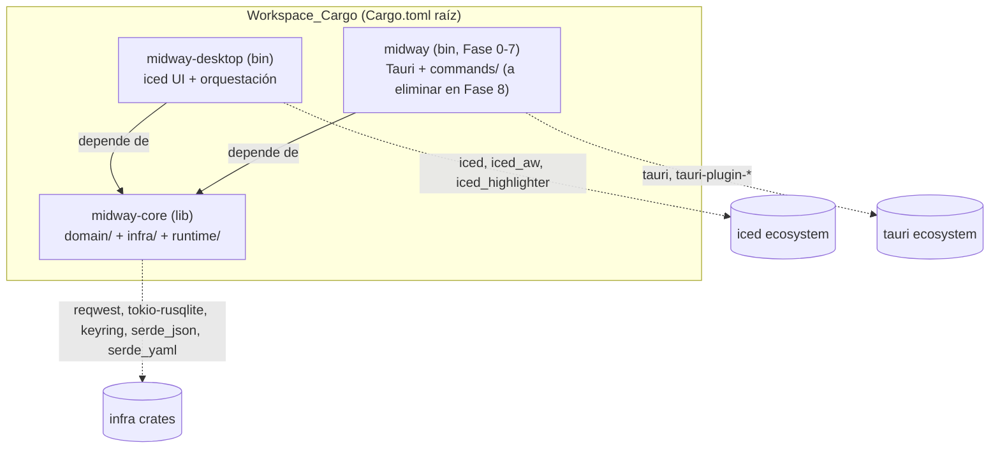
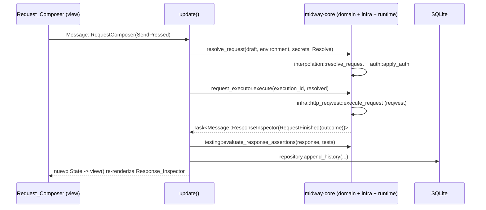

# Design Document

## Overview

Esta migración reemplaza el frontend Tauri + React/TypeScript de Midway por una aplicación de escritorio 100% Rust construida sobre `iced` (arquitectura Elm: `State` + `Message` + `update` + `view`). La lógica de dominio (`domain/`), infraestructura (`infra/`) y runtime de ejecución (`runtime/`) ya escrita en `src-tauri/src/` se extrae a un nuevo crate de librería, `midway-core`, sin reescritura de su lógica interna, y se consume directamente en proceso desde el nuevo crate binario `midway-desktop`, eliminando la capa de comandos IPC (`commands/mod.rs`) que hoy actúa como puente serializado entre React y Rust.

Basado en la revisión del código actual, la lógica reutilizable sin cambios de comportamiento es sustancial:

- `domain/http.rs`, `domain/auth.rs`, `domain/interpolation.rs`, `domain/preview.rs`, `domain/secrets.rs`, `domain/testing.rs`, `domain/runner.rs`, `domain/workspace.rs`, `domain/interop.rs`: lógica pura de resolución de requests, autenticación, interpolación de variables/secrets, generación de preview/cURL, evaluación de assertions, ejecución de collections e import/export Postman/OpenAPI/nativo. No dependen de Tauri.
- `infra/sqlite_repository.rs`, `infra/http_reqwest.rs`, `infra/secret_store.rs`: persistencia SQLite (`tokio-rusqlite`), cliente HTTP (`reqwest`) y keyring del sistema (`keyring`). No dependen de Tauri.
- `runtime/request_executor.rs`: no depende de Tauri.
- `runtime/secret_executor.rs`: **sí** depende de Tauri (`tauri::async_runtime::spawn`). Este es el único punto de acoplamiento a Tauri identificado dentro de `domain/`, `infra/` o `runtime/`, y se resuelve reemplazando la llamada por `tokio::spawn` (el crate `tokio` ya es una dependencia directa), sin cambiar el comportamiento observable del executor.
- `commands/mod.rs` y `state.rs` sí son Tauri-específicos (usan `tauri::State`, `tauri::AppHandle`, `#[tauri::command]`, `Emitter`) y **no** se migran tal cual: su lógica de orquestación (resolver environment, ejecutar request, persistir historial, emitir progreso de collection runner) se reimplementa como funciones libres en `midway-desktop` que invocan directamente las funciones de `midway-core`, sustituyendo la emisión de eventos Tauri (`app.emit`) por mensajes (`Message`) despachados dentro del ciclo `update` de iced.

Toda la lógica UI-adyacente que hoy vive en TypeScript (`src/lib/curl.ts`, `src/lib/commandPalette.ts`, `src/lib/diagnostics.ts`, `src/lib/updater.ts`) no tiene equivalente Rust y debe reescribirse íntegramente dentro de `midway-desktop` (o `midway-core` cuando opera sobre tipos de dominio, como el parser de cURL). El componente `CodeEditor.tsx` (CodeMirror) se reemplaza por `iced::widget::text_editor` + `iced_highlighter`. El sistema de actualizaciones (`tauri-plugin-updater`) se reemplaza por una implementación manual sobre `reqwest` que consume el mismo formato `latest.json`/`latest-beta.json`/`SHA256SUMS.txt` ya publicado por el pipeline de release.

## Architecture

### Cargo workspace



`midway-core` no declara dependencia directa ni transitiva sobre `tauri`. `midway` (Tauri) permanece como miembro del workspace y consumidor de `midway-core` durante las Fases 0-7, y se elimina completamente en la Fase 8 junto con `src-tauri/` y el frontend TypeScript (`src/`).

```
Cargo.toml                 # workspace raíz: members = ["midway-core", "midway-desktop", "src-tauri"]
midway-core/
  Cargo.toml
  src/
    lib.rs                 # pub mod domain; pub mod infra; pub mod runtime;
    domain/ ...             # movido sin reescritura desde src-tauri/src/domain
    infra/ ...               # movido sin reescritura desde src-tauri/src/infra
    runtime/ ...             # movido, con tauri::async_runtime::spawn -> tokio::spawn
midway-desktop/
  Cargo.toml
  src/
    main.rs                 # entry point: construye AppState y arranca iced::application
    app.rs                   # State, Message, update, view, subscription
    state.rs                 # AppState (repository, request_executor, secret_executor)
    curl.rs                  # port de src/lib/curl.ts
    command_palette.rs        # port de src/lib/commandPalette.ts
    diagnostics.rs             # port de src/lib/diagnostics.ts (crash log persistente)
    session.rs                  # nuevo: Session_Store (autosave, closed-tab stack, restore)
    updater.rs                   # port + reescritura de src/lib/updater.ts (sin Tauri)
    export_snippets.rs             # port de src/lib/requestExport.ts (curl/fetch/axios)
    ui/
      request_composer.rs
      response_inspector.rs
      request_tabs.rs               # Params/Headers/Auth/Body/Tests
      workspace_panel.rs             # Environments/Data/History/Diagnostics/App updates
      collection_runner.rs
      command_palette_view.rs
      text_editor.rs                  # wrapper sobre iced::widget::text_editor + iced_highlighter + búsqueda
src-tauri/                    # crate `midway` (Fase 0-7), eliminado en Fase 8
  src/commands/, src/state.rs (sin cambios de comportamiento; delega a midway-core)
```

### Elm architecture en iced

`midway-desktop` usa el patrón funcional de `iced` 0.14 (`iced::application(title_fn, update_fn, view_fn).subscription(subscription_fn).run_with(boot_fn)`), donde:

- **State**: struct `Midway` que contiene el `AppState` (repositorio SQLite, executor de requests, executor de secrets), el `WorkspaceSnapshot` cacheado en memoria, la lista de tabs de request abiertas (`Vec<RequestTabState>`), el tab activo, el estado del panel lateral (`Workspace_Panel`), el estado del Command_Palette, el estado del Collection_Runner en curso, el estado del `Session_Store` y el estado del `Updater`.
- **Message**: enum `Message` con variantes agrupadas por área (`RequestComposer(RequestComposerMessage)`, `ResponseInspector(...)`, `Workspace(...)`, `Runner(...)`, `Palette(...)`, `Session(...)`, `Updater(...)`, `Keyboard(...)`), siguiendo el patrón estándar de composición de mensajes en apps iced de tamaño medio/grande.
- **update**: despacha cada mensaje a la función de actualización del área correspondiente, devolviendo `Task<Message>` para efectos asíncronos (llamadas a `midway-core`, escritura de sesión, descarga del updater).
- **view**: compone `Request_Composer`, `Response_Inspector`, tabs de request, `Workspace_Panel`, overlay del `Command_Palette` (vía `iced::widget::stack`) y el `Error_Boundary` por-componente.
- **subscription**: combina (a) el timer de autosave del `Session_Store` (`iced::time::every`), (b) el listener global de teclado para shortcuts, y (c) el stream de progreso del `Collection_Runner` mientras hay una ejecución en curso.

### Integración async con `midway-core`

`midway-core` es íntegramente `async` sobre `tokio` (via `tokio-rusqlite`, `reqwest`, `tokio::sync`). `iced` 0.14 soporta ejecutar futuros arbitrarios devueltos por `Task::perform(future, Message::from)` sobre su propio pool de tareas; para evitar mezclar executors, `midway-desktop` habilita el feature `tokio` de `iced` (que delega la ejecución de `Task`s asíncronas al runtime de Tokio ya usado por `midway-core`), preservando exactamente el mismo patrón de `RequestExecutorHandle`/`SecretExecutorHandle` (actor con canal `mpsc`/`oneshot`) que ya existe, solo reemplazando el punto de entrada (`tauri::async_runtime::spawn` → `tokio::spawn`) y el mecanismo de notificación de progreso (`app.emit` → `Task::perform` devolviendo mensajes que la suscripción de progreso reenvía a `update`).

### Flujo de una request (Fase 1)



## Components and Interfaces

### Request_Composer y Response_Inspector (Fase 1)

- **Método + URL + Send + environment selector + settings**: fila superior con `pick_list` (método), `text_input` (URL), `button` (Send), `pick_list` (environment), `button` (ícono engranaje → abre preview drawer). El estado de envío en curso deshabilita el botón Send y muestra un spinner (reutilizando el patrón visual existente).
- **Curl_Importer** (`midway-desktop/src/curl.rs`, tipos de `midway-core::domain::http`): port directo de `src/lib/curl.ts` (tokenizador de cURL con manejo de comillas simples/dobles/escapes, mapeo de flags `-X/--request/-H/--header/-u/--user/-d/--data*/-F/--form*/--json/-G/--get/-I/--head`, inferencia de body JSON/texto/form-data). Se invoca en el manejador de "paste" del `text_input` de la URL: si `looks_like_curl_command(pasted)` es verdadero y el parseo tiene éxito, decide (según si la tab activa está vacía) sobrescribir la tab activa o crear una nueva tab, replicando exactamente las reglas de los Criterios 2.7/2.8; si el parseo falla se muestra un error sin tocar el campo; si el texto no parece cURL, se inserta como texto plano.
- **Response_Inspector**: tabs Body/Headers/Tests sobre el `ResponseEnvelope` + `AssertionReport` ya devueltos por `midway-core::domain::testing::evaluate_response_assertions` (sin reescritura de esa lógica). La tab Tests renderiza, para cada `AssertionResult`, su estado aprobado/fallido, valor esperado/actual y mensaje.
- **Text_Editor_Component** (`midway-desktop/src/ui/text_editor.rs`): wrapper sobre `iced::widget::text_editor::Content` + `iced_highlighter::Highlighter` configurado con `Settings { theme: "InspiredGitHub"/"base16-ocean.dark", token: "json" }` para resaltado de sintaxis JSON. El formateo usa `serde_json::from_str` + `serde_json::to_string_pretty`; el lint usa el `serde_json::Error` capturado, extrayendo `.line()` y `.column()` para el mensaje mostrado. La búsqueda de texto (Criterio 2.15) no tiene un widget equivalente publicado en el ecosistema de iced (ver Requisito 11.2/11.3): se implementa manualmente sobre el `Content` del editor, calculando todas las coincidencias de una subcadena (case-insensitive) contra el texto plano y manteniendo un índice de "coincidencia actual" navegable con next/previous, resaltado mediante decoraciones de highlighter por rango.
- **Preview**: botón de settings abre un panel que muestra el resultado de `domain::preview::make_preview(resolution)` (sin reescritura), incluyendo el comando cURL equivalente generado por `domain::preview::make_curl_command`.

### Tabs de configuración del request (Fase 2)

- Se implementan con `iced_aw::{TabBar, Tabs}` (feature `tabs`/`tab_bar`) para Params/Headers/Auth/Body/Tests, reutilizando el mismo widget para las tabs de Response (Body/Headers/Tests) y para las secciones del `Workspace_Panel`.
- La selección de tab por defecto según método HTTP (Params para GET/HEAD/OPTIONS, Body para POST/PUT/PATCH/DELETE) se calcula en `update` cuando cambia el método, solo si el usuario no fijó manualmente una tab para ese draft (se guarda un flag `manual_tab_override: bool` en `RequestTabState`).
- Auth: `pick_list` de tipo (None/Bearer/Basic/ApiKey) sobre `domain::http::AuthConfig`; al cambiar de tipo se reemplaza la variante completa por su default vacío (descartando campos previos, Criterio 3.10).
- Params/Headers: editor de filas key/value/enabled reutilizando `domain::http::KeyValueRow`, con acciones agregar/editar/eliminar/toggle.
- Tests: editor de `domain::testing::ResponseAssertion` (source/operator/selector/expected) que llama a `evaluate_response_assertions` (motor existente, sin reescritura) al recibir una respuesta.

### Workspace_Panel lateral (Fase 3)

- Secciones Environments/Data/History/Diagnostics/App updates dentro de `iced_aw::Tabs` en un panel lateral colapsable.
- **Environments**: CRUD sobre `domain::workspace::EnvironmentRecord` vía `infra::sqlite_repository::SqliteRepository`; validación de nombre duplicado y límites (100 environments, 100 caracteres de nombre) se agrega como validación nueva en `midway-desktop` antes de invocar `save_environment` (la infra actual no impone este límite, por lo que la validación se hace en la capa de orquestación de escritorio, igual que en Tauri se haría en `commands/mod.rs`).
- **Data**: export/import reutilizando `domain::interop` (`export_postman_collection`, `import_postman_collection`, `import_openapi_document`, `make_native_bundle`/`parse_native_bundle`) sin reescritura; el límite de 10 MB para import se valida sobre el tamaño del payload leído antes de parsear.
- **History**: lista `domain::workspace::HistoryEntry` desde `workspace_snapshot`, límite de 500 registros (ajustar `HISTORY_LIMIT` que hoy es 50 en `commands/mod.rs`, moverlo a una constante en `midway-desktop`).
- **Diagnostics**: nuevo módulo `midway-desktop/src/diagnostics.rs` (no existe en `domain`/`infra`, port de `src/lib/diagnostics.ts`) que persiste hasta 200 `CrashRecord` en un archivo JSON dentro del data dir de la app (reemplazo de `window.localStorage`), alimentado por el `Error_Boundary` de cada componente y por un hook de panic (`std::panic::set_hook`) que registra el panic sin abortar el proceso completo cuando es capturado dentro del ciclo `update`/`view` (ver Error Handling).
- **App updates**: card con el estado del `Updater` (sin actualizaciones / disponible / descargando / lista para instalar), reemplazo directo de `UpdateCenterCard.tsx`.

### Collection_Runner (Fase 4)

- Reutiliza `domain::runner` (tipos `CollectionRunReport`, `CollectionRunItem`, fases) y la lógica de orquestación secuencial hoy implementada en el comando `run_collection` de `commands/mod.rs`, migrada a una función libre `midway_desktop::collection_runner::run_collection(...)` que, en lugar de `app.emit(COLLECTION_RUN_PROGRESS_EVENT, ...)`, devuelve una secuencia de mensajes de progreso a través de un canal `mpsc` consumido por una `iced::subscription` mientras `CollectionRunnerState::running` es `Some`. Esto preserva la semántica de progreso incremental (inicio de request, fin de request, reporte final) requerida por el Criterio 5.2.
- Cancelación: se agrega un `oneshot::Sender<()>` compartido entre la tarea de ejecución y el botón "Cancelar"; al cancelarse, el reporte consolidado refleja únicamente los requests ya completados (Criterio 5.8), replicando el patrón ya usado por `RequestExecutorHandle::cancel`.

### Command Palette, Session_Store y shortcuts (Fase 5)

- **Command_Palette** (`midway-desktop/src/command_palette.rs`): port directo del algoritmo de scoring de `src/lib/commandPalette.ts` (normalización, coincidencia exacta/prefijo/substring sobre título, keywords y subtítulo, con pesos idénticos) operando sobre una lista de `CommandPaletteItem` construida a partir de acciones fijas, colecciones y requests guardados. Se abre con `Ctrl/Cmd+K` (overlay vía `iced::widget::stack`) y se cierra al ejecutar un ítem.
- **Session_Store** (`midway-desktop/src/session.rs`, nuevo): serializa un `SessionSnapshot { version: u32, open_tabs: Vec<TabSnapshot>, active_tab_id: Option<String>, panel_sizes: PanelSizes, closed_tabs: VecDeque<TabSnapshot> }` a un archivo `session.json` en el data dir, escrito de forma atómica (`write` a archivo temporal + `rename`) para tolerar crashes a mitad de escritura. El autosave se dispara desde una `iced::time::every(Duration::from_millis(...))` subscription que solo persiste si hubo cambios desde el último guardado, garantizando el máximo de 2 segundos desde la última modificación (Criterio 6.3). Al iniciar, si el archivo existe pero no puede deserializarse o su campo `version` no es compatible, se descarta y se inicia una sesión vacía, notificando al usuario (Criterio 6.10).
- **Stack de tabs cerradas**: `VecDeque<TabSnapshot>` acotado a 20 elementos (se descarta el más antiguo al superar el límite) con reapertura LIFO (`pop_back`/`push_back` según convención elegida, documentado en el código).
- **Unsaved changes**: al cerrar una tab con `draft` distinto del último guardado, se muestra un modal (overlay `stack`) con Guardar/Descartar/Cancelar.
- **Shortcuts**: `iced::keyboard::on_key_press` a nivel de aplicación (via `subscription`) mapeado a la tabla de shortcuts del Criterio 6.8 (Ctrl+Enter, Ctrl+S, Ctrl+Shift+N, Ctrl+Shift+P, Ctrl+., Ctrl+K, Ctrl+W, Ctrl+Shift+T, Alt+1..9, Esc).
- **Error_Boundary**: iced no tiene un mecanismo de recuperación de panics dentro de `view`/`update` como React (`componentDidCatch`); se implementa envolviendo cada handler de `update` de área (Request Composer, Runner, etc.) y cada cierre de `view` de un componente aislado con `std::panic::catch_unwind` (los tipos de estado relevantes deben ser `UnwindSafe`/envueltos en `AssertUnwindSafe` donde corresponda), registrando el panic capturado vía `diagnostics::append_crash_record` y sustituyendo el `Element` de ese componente por un mensaje de error visible, sin interrumpir el resto de la aplicación (Criterio 6.9).

### Updater in-app (Fase 6)

- Reemplaza `tauri-plugin-updater` por un módulo manual `midway-desktop/src/updater.rs` sobre `reqwest` (ya dependencia de `midway-core`, reexportado o duplicado como dependencia directa de `midway-desktop`):
  1. Descarga `latest.json`/`latest-beta.json` según canal configurado.
  2. Compara versiones con el crate `semver` (nueva dependencia pinneada) contra `env!("CARGO_PKG_VERSION")`.
  3. Descarga el artefacto de la plataforma actual reportando progreso por chunks recibidos (stream de `reqwest::Response::bytes_stream`), actualizando un mensaje de progreso al menos 1 vez por segundo.
  4. Verifica SHA256 del artefacto descargado (crate `sha2`, nueva dependencia pinneada) contra `SHA256SUMS.txt`.
  5. Si el checksum coincide, instala (reemplazo del binario/instalador según plataforma) y ofrece relanzar; si no coincide, descarta el artefacto y muestra error sin tocar la instalación existente.
- No existe en crates.io un crate publicado, no archivado/deprecado y con release en los últimos 12 meses que implemente este protocolo específico (manifest `latest.json` + `SHA256SUMS.txt` compatible con el pipeline de release ya existente de Midway); crates como `self_update` asumen el modelo de "GitHub Releases + naming convention" y no son compatibles sin adaptar el formato de manifest ya publicado. Por Requisito 11.3, se documenta esta ausencia de alternativa y se implementa manualmente.

### Empaquetado y distribución (Fase 7)

- Se reemplaza `tauri-build`/Tauri CLI por **`cargo-packager`** (crate `cargo-packager`, versión `0.11.8`, publicado 2025-11-27, dentro de los últimos 12 meses — cumple Criterio 8.1), que genera instaladores Windows (NSIS/MSI) y Linux (AppImage/deb) para `midway-desktop`.
- `scripts/release/render-tauri-config.mjs` se reemplaza por un script equivalente que genera la configuración de `cargo-packager` (`Cargo.toml [package.metadata.packager]` o `packager.json`) para los canales estable/beta, preservando identifier, productName, homepage y publisher.
- `scripts/release/generate-updater-json.mjs` y `scripts/release/generate-checksums.mjs` se mantienen prácticamente sin cambios (son agnósticos al empaquetador: leen los assets subidos al release de GitHub y generan `latest.json`/`latest-beta.json`/`SHA256SUMS.txt`), solo ajustando los patrones de nombre de archivo esperados a los que produce `cargo-packager`.
- `.github/workflows/ci.yml` y `.github/workflows/release.yml` se adaptan para: (a) quitar los pasos de Node/npm específicos del frontend TypeScript (build:ci del frontend Vite) una vez que Fase 8 elimina `src/`, manteniéndolos hasta entonces por paridad; (b) reemplazar `tauri-apps/tauri-action` por la invocación de `cargo packager` sobre `midway-desktop`; (c) mantener la matriz Windows/Linux x86_64 y la firma/checksum de artefactos.

## Data Models

### Mensajes de nivel superior (`midway-desktop/src/app.rs`)

```rust
#[derive(Debug, Clone)]
pub enum Message {
    RequestComposer(RequestComposerMessage),
    ResponseInspector(ResponseInspectorMessage),
    Workspace(WorkspaceMessage),
    Runner(RunnerMessage),
    Palette(PaletteMessage),
    Session(SessionMessage),
    Updater(UpdaterMessage),
    Keyboard(KeyboardMessage),
    Tick, // autosave / progreso periódico
}

pub struct Midway {
    pub app_state: Arc<AppState>,             // repository, request_executor, secret_executor
    pub workspace: WorkspaceSnapshot,          // cache en memoria, refrescado tras cada mutación
    pub tabs: Vec<RequestTabState>,
    pub active_tab: Option<usize>,
    pub closed_tabs: VecDeque<TabSnapshot>,
    pub workspace_panel: WorkspacePanelState,
    pub palette: PaletteState,
    pub runner: Option<CollectionRunnerState>,
    pub session: SessionStoreState,
    pub updater: UpdaterState,
    pub crash_log: Vec<CrashRecord>,
}

pub struct RequestTabState {
    pub id: String,
    pub draft: RequestDraft,          // domain::http::RequestDraft (midway-core)
    pub saved_draft: Option<RequestDraft>, // último estado persistido, para detectar "dirty"
    pub active_request_tab: RequestTab,     // Params | Headers | Auth | Body | Tests
    pub manual_tab_override: bool,
    pub response: Option<ResponseOutcome>,  // ResponseEnvelope + AssertionReport
    pub preview: Option<RequestPreview>,
    pub sending: bool,
    pub execution_id: Option<String>,
}
```

Todos los tipos de dominio (`RequestDraft`, `ResponseEnvelope`, `AssertionReport`, `EnvironmentRecord`, `CollectionRunReport`, etc.) se reutilizan sin cambios desde `midway_core::domain::*`; `midway-desktop` solo agrega tipos de estado de UI que envuelven esos tipos.

### Formato de sesión persistida (`session.json`)

```rust
#[derive(Debug, Clone, Serialize, Deserialize)]
pub struct SessionSnapshot {
    pub version: u32,                  // 1
    pub active_tab_id: Option<String>,
    pub open_tabs: Vec<TabSnapshot>,
    pub closed_tabs: Vec<TabSnapshot>, // orden: más reciente primero, máx. 20
    pub panel_sizes: PanelSizes,
    pub saved_at: String,              // RFC3339
}

#[derive(Debug, Clone, Serialize, Deserialize)]
pub struct TabSnapshot {
    pub id: String,
    pub draft: RequestDraft,           // reutiliza el tipo de dominio (serde ya derivado)
    pub active_request_tab: RequestTab,
}

#[derive(Debug, Clone, Serialize, Deserialize)]
pub struct PanelSizes {
    pub workspace_panel_width: f32,
    pub response_panel_height: f32,
}
```

### Formato de diagnostics (`diagnostics.json`)

```rust
#[derive(Debug, Clone, Serialize, Deserialize)]
pub struct CrashRecord {
    pub id: String,
    pub source: CrashSource,           // WindowError | UnhandledPanic | ComponentBoundary
    pub message: String,
    pub stack: Option<String>,
    pub created_at: String,            // RFC3339
}
```

### Manifest del updater (`latest.json` / `latest-beta.json`, sin cambios de esquema)

```rust
#[derive(Debug, Clone, Deserialize)]
pub struct UpdateManifest {
    pub version: String,
    pub notes: String,
    pub pub_date: String,
    pub platforms: BTreeMap<String, UpdatePlatformEntry>, // clave: "linux-x86_64", "windows-x86_64"
}

#[derive(Debug, Clone, Deserialize)]
pub struct UpdatePlatformEntry {
    pub url: String,
    pub signature: String, // se reinterpreta como referencia al checksum en SHA256SUMS.txt
}
```

## Correctness Properties

*A property is a characteristic or behavior that should hold true across all valid executions of a system-essentially, a formal statement about what the system should do. Properties serve as the bridge between human-readable specifications and machine-verifiable correctness guarantees.*

Las propiedades siguientes se derivaron de los criterios de aceptación de `requirements.md` tras un análisis de testabilidad (prework). Los criterios puramente de infraestructura/UI visual (look & feel, wiring de CI, empaquetado) se excluyeron por no ser aptos para PBT; se cubren en cambio con tests de integración/smoke descritos en Testing Strategy. Algunas propiedades combinan varios criterios relacionados (p. ej. las cuatro reglas de enrutamiento del `Curl_Importer`, o las ocho reglas del `Collection_Runner`) cuando un único enunciado universal las cubre sin pérdida de cobertura, y se eliminó como redundante la propiedad de "recuperación tras crash" (Criterio 6.7) al ser una consecuencia directa del round-trip de sesión (Propiedad 20).

### Property 1: Equivalencia de parseo cURL con la referencia TypeScript

Para cualquier comando cURL sintácticamente válido (método, URL, query params, headers, autenticación básica/bearer, body JSON/texto/form-data) del espacio de comandos soportado por `src/lib/curl.ts`, parsearlo con `Curl_Importer` (Rust) SHALL producir los mismos campos de configuración de request (método, URL, query params, headers, auth, body) que produce la implementación TypeScript de referencia para ese mismo comando.

**Validates: Requirements 2.6, 2.16**

### Property 2: Enrutamiento de pegado de cURL según estado de la tab

Para cualquier estado de la tab activa del `Request_Composer` y cualquier comando cURL válido pegado en la barra de URL: si la tab activa está vacía (método `GET`, URL vacía, sin params/headers/body/auth), el pegado SHALL sobrescribir los campos de la tab activa con los datos extraídos; si la tab activa contiene algún dato no vacío, el pegado SHALL crear una nueva tab con los datos extraídos y SHALL dejar la tab activa original sin modificar.

**Validates: Requirements 2.7, 2.8**

### Property 3: Texto no-cURL se inserta como texto plano

Para cualquier texto pegado en la barra de URL que no comience con `curl`/`curl.exe` o del cual no pueda extraerse una URL, el resultado SHALL ser la inserción literal de dicho texto en la barra de URL, sin invocar ninguna extracción de campos del `Curl_Importer`.

**Validates: Requirements 2.9**

### Property 4: cURL malformado no muta el contenido existente

Para cualquier texto pegado que comience con `curl`/`curl.exe` pero cuyo parseo falle (por ejemplo, un flag que requiere valor y no lo tiene), el `Curl_Importer` SHALL mostrar un mensaje de error y el contenido previamente existente en la barra de URL SHALL permanecer exactamente igual al estado anterior al pegado.

**Validates: Requirements 2.19**

### Property 5: Formateo JSON es idempotente y preserva el valor

Para cualquier valor JSON arbitrario, formatearlo con el `Text_Editor_Component` y volver a formatear el resultado SHALL producir el mismo texto (idempotencia), y el valor deserializado del texto formateado SHALL ser estructuralmente igual al valor original antes de formatear.

**Validates: Requirements 2.13**

### Property 6: El lint JSON reporta la posición exacta del error

Para cualquier cadena que no sea JSON válido, el lint del `Text_Editor_Component` SHALL reportar una línea y columna que coincidan exactamente con `serde_json::Error::line()`/`column()` obtenidos al parsear esa misma cadena.

**Validates: Requirements 2.14**

### Property 7: La búsqueda de texto encuentra todas las coincidencias sin omitir ni duplicar

Para cualquier contenido de texto y cualquier subcadena de búsqueda no vacía, el conjunto de posiciones de coincidencia case-insensitive calculado por el `Text_Editor_Component` SHALL ser exactamente el conjunto de todas las ocurrencias de la subcadena en el texto, y la navegación secuencial (siguiente/anterior) SHALL visitar cada coincidencia exactamente una vez por ciclo completo, sin omitir ni repetir ninguna fuera de orden.

**Validates: Requirements 2.15**

### Property 8: El preview refleja exactamente el draft vigente

Para cualquier `RequestDraft` generado (con cualquier combinación de query params, headers y filas habilitadas/deshabilitadas, auth y body), el preview mostrado al activar el control de settings SHALL ser exactamente el resultado de `domain::preview::make_preview` aplicado a ese draft, incluyendo el comando cURL equivalente generado por `domain::preview::make_curl_command`.

**Validates: Requirements 2.18**

### Property 9: Selección de tab por defecto según método HTTP, salvo override manual

Para cualquier método HTTP soportado y cualquier valor del flag `manual_tab_override`: si `manual_tab_override` es falso, la tab de configuración seleccionada por defecto SHALL ser Params cuando el método es `GET`, `HEAD` u `OPTIONS`, y Body cuando el método es `POST`, `PUT`, `PATCH` o `DELETE`; si `manual_tab_override` es verdadero, la tab activa SHALL permanecer sin cambios al cambiar el método.

**Validates: Requirements 3.2, 3.3**

### Property 10: CRUD de filas key/value equivale a un modelo de referencia

Para cualquier secuencia de operaciones de agregar, editar, eliminar y alternar `enabled` sobre una lista de `KeyValueRow` (Params o Headers), el estado final producido por el `Request_Composer` SHALL ser idéntico al estado producido por un modelo de referencia (lista simple) que aplica la misma secuencia de operaciones en el mismo orden.

**Validates: Requirements 3.8**

### Property 11: Cambiar el tipo de autenticación descarta los campos anteriores

Para cualquier `AuthConfig` inicial con campos no vacíos y cualquier nuevo tipo de autenticación distinto seleccionado, el `AuthConfig` resultante tras el cambio SHALL ser exactamente el valor por defecto vacío de ese nuevo tipo, sin conservar ningún valor del tipo anterior.

**Validates: Requirements 3.10**

### Property 12: Invariantes de CRUD de environments

Para cualquier secuencia de operaciones de creación, edición, eliminación y selección de environments, tras cada operación SHALL sostenerse que: el número total de environments es menor o igual a 100, todo nombre de environment tiene como máximo 100 caracteres, y a lo sumo un environment está marcado como activo simultáneamente.

**Validates: Requirements 4.2**

### Property 13: Validación de import por formato y tamaño

Para cualquier payload de import: si su tamaño es menor o igual a 10 MB y su contenido es válido en alguno de los formatos soportados (nativo workspace v1, Postman Collection v2.1, OpenAPI v3 JSON/YAML), la importación SHALL tener éxito y mutar el estado de datos de forma consistente con el contenido importado; si el tamaño excede 10 MB o el contenido no corresponde a ninguno de los formatos soportados o está corrupto, la importación SHALL fallar mostrando un error descriptivo y el estado de datos existente SHALL permanecer exactamente igual al previo al intento.

**Validates: Requirements 4.4, 4.5**

### Property 14: Colecciones acotadas ordenadas de la más reciente a la más antigua

Para cualquier secuencia de N inserciones en History (límite L=500) o en Diagnostics (límite L=200), el tamaño final de la colección SHALL ser `min(N, L)`, SHALL contener siempre las L entradas más recientemente insertadas cuando N > L, y SHALL estar ordenada de la más reciente a la más antigua.

**Validates: Requirements 4.6, 4.7**

### Property 15: Nombre de environment duplicado se rechaza sin mutar el conjunto existente

Para cualquier conjunto existente de environments y cualquier intento de crear o renombrar un environment usando un nombre ya presente en dicho conjunto, la operación SHALL ser rechazada con un mensaje de error de nombre duplicado, y el conjunto de environments SHALL permanecer exactamente igual al previo al intento.

**Validates: Requirements 4.9**

### Property 16: Eliminar el environment activo limpia la selección activa

Para cualquier workspace con un environment marcado como activo, al eliminar dicho environment el selector de environment activo SHALL quedar sin ningún environment seleccionado.

**Validates: Requirements 4.10**

### Property 17: Colisión de nombre en import preserva ambos elementos

Para cualquier workspace con un elemento existente (environment, request o colección) de nombre N y cualquier importación válida que introduce un elemento con ese mismo nombre N, tras la importación SHALL existir tanto el elemento original sin modificar como el elemento importado bajo un nombre diferenciado, sin pérdida de datos de ninguno de los dos.

**Validates: Requirements 4.11**

### Property 18: Ejecución secuencial y reporte consolidado del Collection_Runner

Para cualquier colección de N requests guardados (incluyendo N=0) y cualquier combinación de resultados simulados por request (éxito, fallo de red/timeout, fallo de al menos una assertion), y para cualquier environment (override o activo por defecto) y cualquier punto de cancelación k (0 <= k <= N): los requests SHALL ejecutarse en el mismo orden en que están guardados; SHALL emitirse exactamente un evento de progreso de inicio y uno de fin por request efectivamente ejecutado con contadores correctos; el reporte consolidado SHALL contener exactamente una entrada por request efectivamente ejecutado (N si no se cancela, k si se cancela tras k requests) reflejando fielmente el resultado simulado de cada uno; los conteos de éxito y fallo del reporte SHALL sumar el total de entradas; todas las resoluciones de request SHALL usar el environment de override cuando esté definido, o el activo por defecto en caso contrario; y con N=0 SHALL obtenerse de inmediato un reporte con cero requests ejecutados sin invocar al executor de requests.

**Validates: Requirements 5.1, 5.2, 5.3, 5.4, 5.5, 5.6, 5.7, 5.8**

### Property 19: El autosave persiste dentro de 2 segundos desde la última modificación

Para cualquier instante de modificación del draft activo dentro del ciclo del timer de autosave, el `Session_Store` SHALL persistir (o marcar como persistido) el estado de sesión en un instante `t` tal que `t <= t_modificación + 2000ms`, y SHALL evitar una re-escritura si no hubo modificaciones desde el último guardado.

**Validates: Requirements 6.3**

### Property 20: Round-trip de la sesión persistida

Para cualquier `SessionSnapshot` generado (tabs abiertas, tab activa, tamaños de panel, tabs cerradas), serializarlo a `session.json` y deserializarlo SHALL producir un `SessionSnapshot` estructuralmente igual al original; esta propiedad, aplicada al último snapshot persistido antes de un cierre inesperado, es la base de la recuperación tras crash (Criterio 6.7).

**Validates: Requirements 6.4, 6.7**

### Property 21: El stack de tabs cerradas está acotado y reabre en orden LIFO

Para cualquier secuencia de cierres (push) y reaperturas (pop) de tabs, el stack de tabs cerradas SHALL nunca exceder 20 elementos (descartando la entrada más antigua al superar el límite), y cada reapertura SHALL devolver exactamente la tab cerrada más recientemente entre las aún presentes en el stack.

**Validates: Requirements 6.5**

### Property 22: Las acciones del aviso de unsaved changes son correctas

Para cualquier tab con un draft distinto de su último `saved_draft`, al mostrarse el aviso de unsaved changes: seleccionar Guardar SHALL persistir el draft (`saved_draft == draft`) y cerrar la tab; seleccionar Descartar SHALL cerrar la tab sin alterar el último `saved_draft` persistido; seleccionar Cancelar SHALL dejar la tab abierta sin modificar su estado.

**Validates: Requirements 6.6**

### Property 23: El Error_Boundary aísla panics de un componente sin derribar la aplicación

Para cualquier handler de área (`update` o cierre de `view`) envuelto en `catch_unwind` que entra en panic con un mensaje arbitrario: la función wrapper SHALL retornar un elemento/mensaje de error en lugar de propagar el panic; SHALL agregarse exactamente un `CrashRecord` nuevo a diagnostics con `source = ComponentBoundary` y el mensaje capturado; y el estado de las demás áreas de la aplicación SHALL permanecer sin alterar.

**Validates: Requirements 6.9**

### Property 24: Sesión corrupta o incompatible se descarta de forma segura

Para cualquier contenido arbitrario de `session.json` que no deserialice como `SessionSnapshot` válido o cuyo campo `version` no sea compatible con la versión soportada, el `Session_Store` SHALL descartar dicho contenido, SHALL iniciar una sesión vacía, y SHALL emitir una notificación al usuario, sin propagar el error de deserialización ni afectar el resto del arranque de la aplicación.

**Validates: Requirements 6.10**

### Property 25: La comparación semver determina correctamente la disponibilidad de actualización

Para cualquier par de versiones semánticas válidas (versión instalada, versión del manifiesto), el `Updater` SHALL reportar que hay una actualización disponible si y solo si la versión del manifiesto es estrictamente mayor que la versión instalada según el orden total de `semver::Version`.

**Validates: Requirements 7.2**

### Property 26: La verificación de checksum es una compuerta estricta antes de instalar

Para cualquier artefacto descargado (bytes arbitrarios) y su checksum SHA256 real: si el checksum esperado (publicado en `SHA256SUMS.txt`) coincide con el checksum real, el `Updater` SHALL proceder a instalar sin mostrar error de corrupción; si el checksum esperado no coincide (incluyendo el caso de un solo bit alterado), el `Updater` SHALL descartar el artefacto, SHALL dejar la instalación existente sin modificar, y SHALL mostrar un mensaje de error indicando que la actualización está corrupta.

**Validates: Requirements 7.4, 7.5, 7.6**

### Property 27: Un fallo de verificación o descarga preserva la versión instalada

Para cualquier error simulado durante la verificación o la descarga de una actualización (fallo de red, timeout, respuesta malformada), el `Updater` SHALL transicionar a un estado de error visible y la versión actualmente instalada SHALL permanecer operativa y sin modificar.

**Validates: Requirements 7.9**

### Property 28: `midway-core` no depende de `tauri`

Para el grafo completo de dependencias directas y transitivas del crate `midway-core` (obtenido vía metadata de Cargo), ningún paquete del grafo SHALL ser `tauri` ni ningún crate cuyo nombre comience con `tauri-`. A diferencia de las propiedades anteriores, esta invariante no varía con datos generados en tiempo de ejecución (el grafo de dependencias es fijo para un `Cargo.lock` dado), por lo que se verifica mediante una única aserción determinística en lugar de iteraciones aleatorias (ver Testing Strategy).

**Validates: Requirements 1.10**

## Error Handling

La estrategia de manejo de errores preserva, en cada capa, el mismo tipo de error ya devuelto por `midway-core` (`domain`/`infra`/`runtime` no cambian sus firmas de error), y agrega en `midway-desktop` una capa de presentación uniforme que traduce esos errores a estado de UI sin abortar el proceso.

- **Errores HTTP y de red** (`domain::http`, `infra::http_reqwest`, `runtime::request_executor`): los errores de conexión, timeout o respuesta HTTP inválida se propagan como variantes ya existentes de `RequestExecutionError`/`Result` de `midway-core`, sin reescritura. En `midway-desktop`, `Message::ResponseInspector(RequestFinished(Err(e)))` renderiza el error dentro del propio `Response_Inspector` (sin bloquear la tab ni el resto de la app) y, durante una ejecución del `Collection_Runner`, se registra como fallo de ese request en el reporte consolidado, continuando con el siguiente (Criterio 5.5).
- **Errores de parseo/lint JSON** (`Text_Editor_Component`): capturados desde `serde_json::Error`, se extraen `.line()`/`.column()` y el mensaje del error se muestra inline en el editor sin interrumpir la edición ni descartar el contenido existente (Criterio 2.14).
- **Errores del `Curl_Importer`**: un comando que comienza con `curl`/`curl.exe` pero no puede parsearse completamente produce un `Result::Err` con el motivo (flag sin valor, quoting inválido, etc.); `midway-desktop` muestra dicho mensaje en un toast/inline junto a la barra de URL y deja el contenido previo de la barra sin modificar (Criterio 2.19), replicando el manejo de errores de `src/lib/curl.ts`.
- **Errores de import/export** (`domain::interop`): tamaño excedido (>10 MB), formato no reconocido o contenido corrupto se representan como variantes de error ya existentes de `import_postman_collection`/`import_openapi_document`/`parse_native_bundle`; `midway-desktop` las traduce a un mensaje descriptivo en la sección Data del `Workspace_Panel` sin mutar el estado de datos existente (Criterio 4.5). La validación de tamaño (10 MB) se realiza antes de invocar el parser, evitando parsear payloads que ya se sabe exceden el límite.
- **Errores de nombre duplicado / límites de environment**: `save_environment` en `midway-desktop` valida duplicados y límites (100 environments, 100 caracteres) antes de delegar a `infra::sqlite_repository`; el rechazo se representa como un error de validación local (no llega a tocar SQLite) y se muestra inline en la sección Environments (Criterio 4.9).
- **Corrupción/incompatibilidad de `session.json`** (`Session_Store`): un fallo de deserialización o un campo `version` no soportado se capturan explícitamente al leer el archivo al inicio; en ambos casos se descarta el contenido, se construye una `SessionSnapshot` vacía, y se despacha un mensaje de notificación visible al usuario indicando que la sesión previa no pudo restaurarse (Criterio 6.10), sin abortar el arranque de `midway-desktop`.
- **Panics dentro de `update`/`view` de un componente** (`Error_Boundary`): cada handler de área y cada cierre de `view` de un componente aislado se envuelve en `std::panic::catch_unwind` (con `AssertUnwindSafe` donde el estado no es `UnwindSafe` por construcción). Un panic capturado: (a) se registra vía `diagnostics::append_crash_record` con `source = ComponentBoundary`, el mensaje del panic y, cuando esté disponible, el backtrace; (b) sustituye el `Element` de ese componente por un mensaje de error visible; (c) no interrumpe el resto de la aplicación, que sigue respondiendo a interacciones del usuario (Criterio 6.9). Un panic fuera de estos límites explícitos (por ejemplo dentro del propio runtime de `iced`) queda fuera del alcance del Error_Boundary y se documenta como limitación conocida.
- **Errores del `Updater`**: fallos de verificación de versión, descarga (red/timeout) o checksum SHA256 no coincidente se representan como variantes de un `UpdaterError` propio de `midway-desktop`; en todos los casos el artefacto parcial/corrupto se descarta, la instalación existente no se toca, y se muestra un mensaje de error descriptivo en la sección App updates del `Workspace_Panel`, manteniendo la versión actualmente instalada operativa (Criterios 7.5, 7.9).
- **Errores de empaquetado/CI** (Fase 7): un fallo de `cargo-packager` para alguna plataforma detiene el pipeline de release antes de publicar artefactos parciales, reportando la plataforma y causa del fallo (Criterio 8.6); esto se maneja a nivel de script/workflow (`scripts/release/*`, `.github/workflows/*`), no dentro de `midway-desktop`.

## Testing Strategy

La estrategia combina tests unitarios (ejemplos concretos, casos borde e integración entre componentes) con tests basados en propiedades (cobertura universal sobre el espacio de entradas) para cada una de las 28 propiedades de la sección anterior, siguiendo el gating por fase del Requisito 10.

### Enfoque dual

- **Tests unitarios**: cubren ejemplos concretos, casos borde y puntos de integración entre componentes (p. ej. Property 2.10/2.11 del prework — passthrough de status/tiempo/tamaño y de resultados de assertions al `Response_Inspector`, apertura del Command_Palette, tabla fija de shortcuts del Criterio 6.8). Se mantienen deliberadamente pocos por área, dejando la cobertura amplia de casos a los tests de propiedades.
- **Tests de propiedades**: implementan cada una de las 28 Correctness Properties como un único test parametrizado con generadores aleatorios, usando **`proptest`** (crate `proptest`, versión pinneada exacta en `Cargo.toml`, sin rangos abiertos) como librería de property-based testing para Rust — no se implementa un motor de PBT desde cero. Cada test se configura con un mínimo de 100 casos por ejecución (`ProptestConfig { cases: 100, ..ProptestConfig::default() }` o el valor por defecto de `proptest`, que ya es 256, ajustado explícitamente a al menos 100).
- Cada test de propiedad se etiqueta con un comentario referenciando la propiedad de diseño correspondiente, siguiendo el formato:
  `// Feature: tauri-to-iced-migration, Property {number}: {property_text}`

### Mapeo de propiedades a estrategia de generadores (resumen)

- **Curl_Importer** (Properties 1-4): generador estructurado de comandos cURL sintácticamente válidos (método, URL, headers, flags de auth, body) más un oráculo derivado de los casos de test existentes de `src/lib/curl.ts` portados como tabla de casos de referencia; generadores de texto arbitrario no-cURL y de comandos cURL truncados/malformados para los casos de error.
- **Text_Editor_Component** (Properties 5-7): generador de `serde_json::Value` arbitrario (anidado, con arrays/objetos/strings con caracteres especiales) para formateo/lint; generador de pares (texto, subcadena) incluyendo casos con y sin coincidencias, mayúsculas/minúsculas mixtas, y subcadenas solapadas.
- **Request_Composer / tabs de configuración** (Properties 8-11): generador de `RequestDraft` arbitrario (métodos, filas key/value habilitadas/deshabilitadas, las 4 variantes de `AuthConfig`, bodies); generador de secuencias de operaciones CRUD (agregar/editar/eliminar/toggle) como `proptest::prop_oneof!` de acciones.
- **Workspace_Panel** (Properties 12-17): generador de secuencias de operaciones de environment (crear/editar/eliminar/seleccionar) con nombres de longitud variable (incluyendo bordes en 100 caracteres); generador de payloads de import válidos por formato (nativo/Postman/OpenAPI) y de payloads corruptos/oversize; generador de secuencias de inserción de History/Diagnostics de tamaño variable N.
- **Collection_Runner** (Property 18): mock de `RequestExecutorHandle` inyectado que, para una colección generada de N requests (incluyendo N=0), devuelve resultados predeterminados por request (éxito/fallo de red/fallo de assertion) según una secuencia generada; generador de punto de cancelación k. Evita llamadas HTTP reales, manteniendo el costo de 100+ iteraciones bajo.
- **Session_Store / Command_Palette / Error_Boundary** (Properties 19-24): reloj simulado (fake clock) para el timer de autosave; generador de `SessionSnapshot` arbitrario para el round-trip; generador de secuencias de push/pop para el stack de tabs cerradas; generador de contenido arbitrario de `session.json` (JSON inválido, versión incompatible) para el fallback; generador de handlers que panican con mensajes arbitrarios para el Error_Boundary (usando mocks, sin necesidad de UI real).
- **Updater** (Properties 25-27): generador de pares de versiones semver válidas vía `semver::Version` (incluyendo prerelease/build metadata); generador de artefactos de bytes arbitrarios con su SHA256 real y variantes con un bit alterado; mock del cliente HTTP inyectando errores de red/timeout/respuesta malformada.
- **`midway-core` sin dependencia de `tauri`** (Property 28): no aplica generación aleatoria — se implementa como un único test determinístico que parsea `cargo metadata --format-version 1` (o `Cargo.lock`) filtrado al subgrafo de `midway-core` y falla si aparece `tauri` o cualquier paquete `tauri-*`.

### Tests de integración

- **`midway-core` sin dependencia de Tauri** (Requisito 1.10 / Property 28): test de integración a nivel de workspace que ejecuta `cargo metadata` y verifica el árbol de dependencias, ejecutado como parte de `cargo test` en cada fase.
- **Flujo de request end-to-end** (Criterio 2.17): servidor HTTP mock local (`wiremock` o `mockito`, versión pinneada) para verificar que Send invoca `resolve_request` + `execute` de `midway-core` con el draft de la tab activa y que la respuesta llega al `Response_Inspector`.
- **Progreso de descarga del Updater** (Criterio 7.3): servidor HTTP local que sirve un artefacto en chunks controlados, verificando frecuencia mínima de actualización de progreso de 1/seg y porcentaje final de 100%.
- **Paridad Tauri vs iced por fase** (Requisito 10.1-10.3): en cada fase, `cargo check` y `cargo test` se ejecutan sobre el workspace completo (los tres crates durante Fases 0-7); una fase no se considera completa si cualquiera de las dos falla, bloqueando el avance a la fase siguiente.
- **Empaquetado y distribución** (Requisito 8): smoke tests de pipeline de CI que verifican generación exitosa de instaladores Windows/Linux y presencia de `latest.json`/`latest-beta.json`/`SHA256SUMS.txt` con 1-2 ejemplos representativos, sin PBT (infraestructura, no lógica propia).

### Tests unitarios de lógica UI-adyacente reescrita (Requisito 10.4)

Para cada pieza de lógica previamente en TypeScript y reescrita en Rust (`curl.rs`, `command_palette.rs`, `diagnostics.rs`, `updater.rs`, `session.rs`), además de las propiedades correspondientes, se incluyen tests unitarios con como mínimo: un caso de camino nominal (entrada típica válida) y un caso de error o borde (entrada inválida, vacía, o en el límite de un rango), documentando explícitamente cuál caso cubre cada test.

### Gating por fase

Siguiendo el Requisito 10, al completar cada fase (0 a 7) se ejecutan `cargo check` y `cargo test` sobre el workspace completo antes de iniciar la fase siguiente; un fallo en cualquiera de los dos bloquea el avance hasta corregirse. Las propiedades y tests unitarios de una fase se agregan como parte del trabajo de esa fase (p. ej. las Properties 1-8 se implementan junto con el `Request_Composer`/`Response_Inspector` en la Fase 1), de forma que el gating de fase incluye siempre la ejecución de los tests de propiedades ya escritos hasta ese punto.
