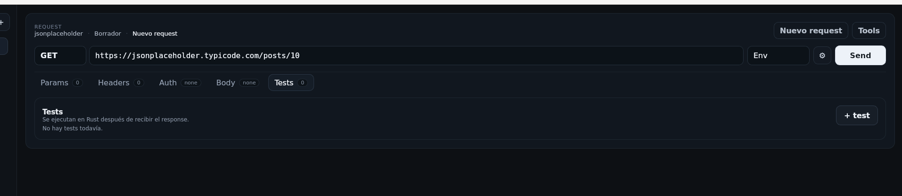

# Midway

Cliente API de escritorio hecho con **Tauri + Rust + React**, diseñado con foco en una experiencia **KISS**, dark mode y **progressive disclosure**.

La idea de Midway es simple: que el flujo principal se sienta liviano y natural, más cerca de **Insomnia/Postman** en familiaridad, pero con una UI más calmada y menos ruidosa.



## Qué es

Midway es un API Client para desarrollo con estas prioridades:

- **Método + URL + Send** como flujo principal dominante
- **Colecciones** limpias, sin sobrecargar la navegación
- **Tabs** para Params, Headers, Auth, Body y Tests
- **Response panel** claro, con status, tiempo y headers legibles
- **Workspace** separado para Environments, Data, History y Diagnostics
- lógica de ejecución, persistencia y secretos resuelta mayormente del lado **Rust**

## Principios de UX

El rediseño sigue estos criterios:

- **Minimalismo funcional**: mostrar solo lo necesario para la tarea actual
- **Progressive Disclosure**: lo avanzado aparece cuando hace falta, no antes
- **Carga cognitiva baja**: menos formularios persistentes, menos ruido, más foco
- **Jerarquía clara**: el request manda; lo secundario vive en settings, workspace o acciones de colección
- **Dark mode real**: paneles sobrios, contraste controlado y superficies simples

## Funcionalidades principales

### Request composer

- selector de método HTTP (`GET`, `POST`, `PUT`, `PATCH`, `DELETE`, `HEAD`, `OPTIONS`)
- barra de URL dominante
- botón primario **Send**
- selector de environment compacto
- settings del request por engranaje
- preview del request dentro de settings
- import directo de **cURL** pegándolo en la URL

### Configuración del request

Tabs dedicados para:

- **Params**
- **Headers**
- **Auth**
- **Body**
- **Tests**

Con selección por defecto pensada para el caso de uso:

- `Params` en requests tipo `GET`
- `Body` en requests tipo `POST` / `PUT` / `PATCH`

### Response inspector

- status code destacado
- tiempo de respuesta
- tamaño del payload
- tabs para `Body`, `Headers` y `Tests`
- headers renderizados como tabla `Key / Value`
- body con editor técnico y búsqueda

### Workspace

El panel lateral secundario concentra lo no esencial al flujo principal:

- **Environments**
- **Data**
  - Import
  - Export
- **History**
- **Diagnostics**
- **App updates**

### Runner por colección

- ejecución secuencial de requests guardados
- reporte consolidado
- progreso del runner vía eventos
- override opcional de environment al correr

## Persistencia, recuperación y confianza

Midway ya incorpora varias capas para que trabajar se sienta confiable:

- **autosave** del draft activo
- **restore de sesión** al reabrir la app
- persistencia de:
  - tabs abiertas
  - tab activa
  - paneles redimensionados
  - stack de tabs cerradas
- aviso por **unsaved changes** al cerrar
- recuperación de sesión luego de cierre inesperado
- captura local de crashes y un **error boundary** para recuperación segura de la UI

## Interoperabilidad

### cURL paste import

Podés pegar un comando completo que empiece con `curl` en la barra de URL y Midway intenta inferir:

- método
- URL
- query params
- headers
- auth básica o bearer
- body

Si la tab actual está vacía, la reutiliza. Si ya tiene trabajo, crea una nueva tab para no pisarte cambios.

### Import / Export

Soporta:

- **native workspace v1** para backup y restore completo o export de colección reimportable
- **Postman Collection v2.1** para interoperar con Postman e Insomnia
- **OpenAPI v3** importable desde payload pegado o archivo **JSON o YAML**
- export del request actual como **cURL**, **fetch** o **axios** desde request settings

## Novedades de esta versión

- **Secrets en keychain** del sistema operativo
- **Command Palette** (`⌘/Ctrl + K`) para acciones rápidas, colecciones y requests
- editor real con **CodeMirror** para body / preview / response
- **format JSON**, lint JSON y búsqueda dentro del editor
- **multipart/form-data** con campos de texto o archivos
- cancelación manual del request en curso
- **cookies de sesión** vía `reqwest` entre requests
- import de **OpenAPI v3** (**JSON o YAML**) y Postman desde archivo o payload pegado
- export del request actual como **cURL**, **fetch** o **axios**
- export nativo de **colección Midway** para compartir o reimportar
- diagnostics locales para errores/crashes del frontend
- **updater in-app** con check, descarga, instalación y relaunch
- smoke tests + tests UI + **budgets de tamaño** (`npm run test`, `npm run size:check`)

## Shortcuts

- `⌘/Ctrl + Enter` → Send
- `⌘/Ctrl + S` → Guardar
- `⌘/Ctrl + Shift + N` → Nuevo request
- `⌘/Ctrl + Shift + P` → Preview
- `⌘/Ctrl + .` → Tools / Workspace
- `⌘/Ctrl + K` → Command Palette
- `⌘/Ctrl + W` → Cerrar tab activa
- `⌘/Ctrl + Shift + T` → Reabrir tab
- `Alt + 1..9` → Ir a tab abierta
- `Esc` → Cerrar panel o settings

## Stack técnico

### Frontend

- React
- TypeScript
- Vite
- CodeMirror
- Tauri API

### Backend / Desktop

- Tauri
- Rust
- SQLite
- reqwest
- keyring del sistema operativo

## Cómo levantar el proyecto

### Desarrollo web

```bash
npm install
npm run dev
```

### Desarrollo desktop con Tauri

```bash
npm install
npm run tauri:dev
```

### Quality gate local

```bash
npm run build:ci
```

### Build frontend

```bash
npm run build
```

### Build desktop

```bash
npm run tauri:build
```

## Estructura general

```text
src/
  App.tsx
  App.css
  main.tsx
  components/
  lib/
  tauri/
    api.ts
    types.ts

src-tauri/
  src/
    commands/
    domain/
    infra/
    runtime/
```

## Distribución y releases

El repo ya trae una base seria de distribución:

- workflow de **CI** con `build`, tests, budget de tamaño y `cargo check`
- workflow de **release** con draft releases en GitHub
- **artifact attestations** de GitHub Actions
- generación de `latest.json` / `latest-beta.json` para updater
- generación de `SHA256SUMS.txt`
- configuración por plataforma para **Windows**, **macOS** y **Linux**
- categorías de release notes en `.github/release.yml`
- overlays generados de config para no hardcodear repo/pubkey/bundle identifier

La guía operativa quedó en:

```text
docs/distribution.md
```

## Estado del proyecto

Hoy Midway ya está en un punto sólido para:

- demos
- uso interno fuerte
- beta privada con usuarios reales
- iteración rápida sobre UX, release y flujo de trabajo

Todavía no lo presentaría como release pública final sin antes validar en máquinas reales:

- firma/notarización completa por plataforma
- updater de release a release en instalaciones limpias
- mTLS / proxy / TLS avanzado si el target lo necesita
- más cobertura E2E multi-plataforma

## Roadmap cercano

- OAuth2 helper
- proxy / mTLS / custom CA
- imports más profundos de OpenAPI
- más cobertura E2E de updater e instalación
