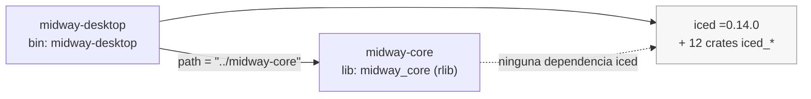
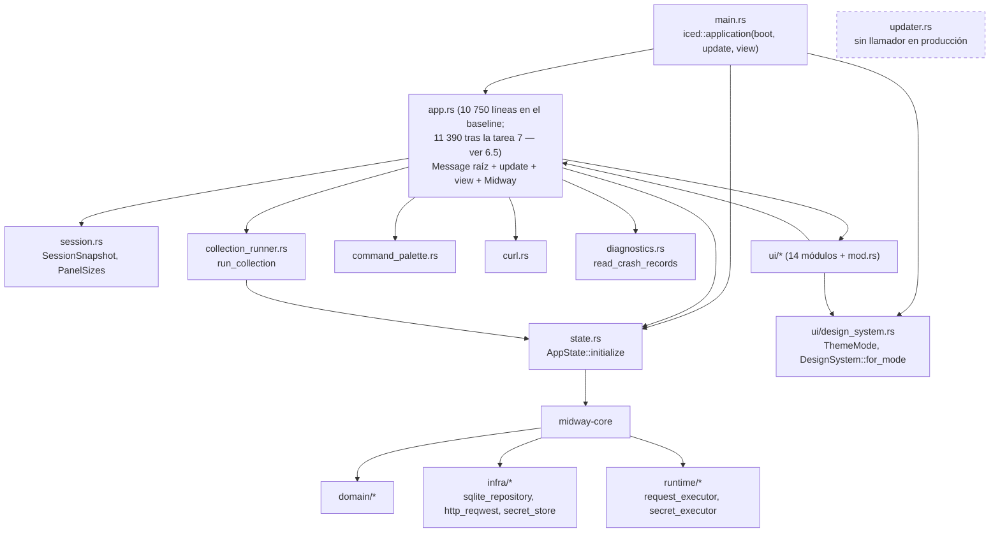
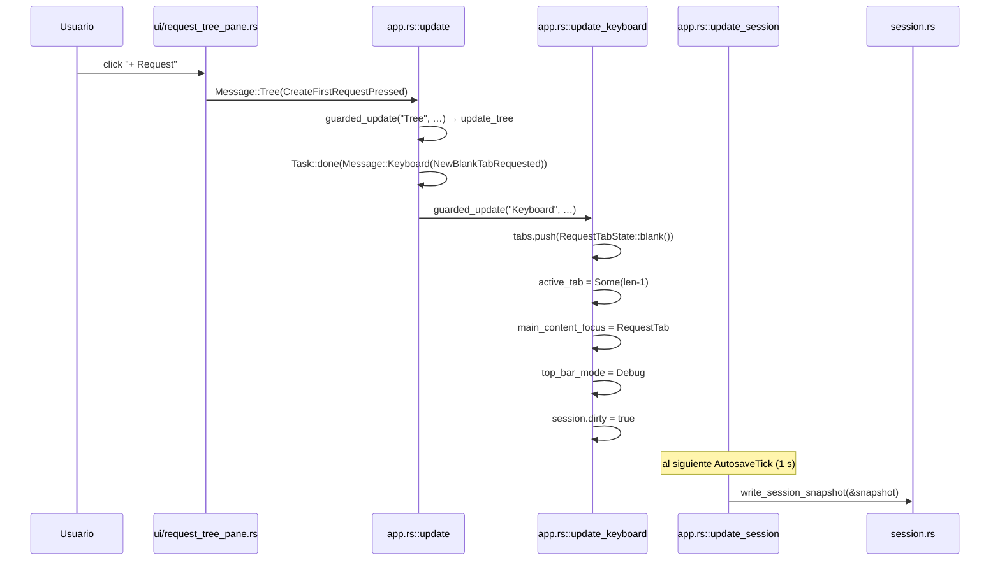
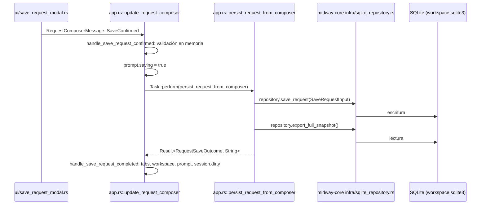
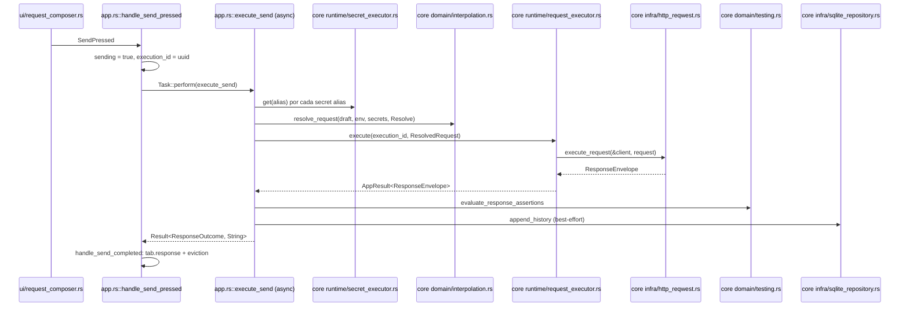
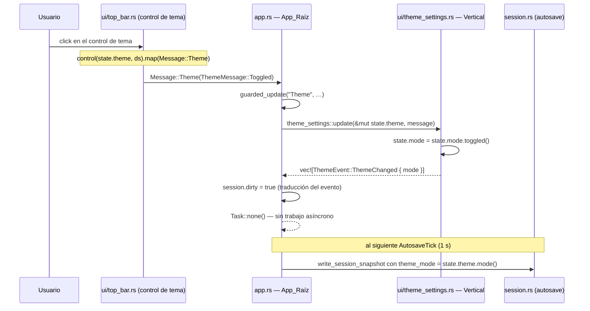

# Arquitectura de Midway — mapas del baseline

> Documento de auditoría. Describe la arquitectura tal como está en el baseline de `main`
> (HEAD `1fc270326e5c304f24ce08fe1f528da33a007d3e`), no la arquitectura objetivo.
>
> Alcance de este archivo. Las secciones 1 a 5 (mapa de dependencias, mapa de estado, mapa
> de flujos, notas de método y diferencias con el documento de diseño) se escribieron en la
> tarea 2.4 sobre el baseline sin cambios. Las secciones 6 ("Patrón de extracción de
> vertical", Req 8.10) y 7 ("Verticales candidatas restantes", Req 8.11) las agregó la tarea
> 8.1, después de que la vertical Tema/Ajustes existiera y estuviera cableada: el patrón se
> documenta ejercitado, no anticipado.
>
> **Cómo leer las secciones 1 a 5 después de la tarea 8.1.** No se reescribieron. Los datos
> que la extracción de la vertical invalidó se corrigieron en su lugar, con la anotación
> `[Corregido en 8.1]` en la fila afectada, y están listados juntos en 6.5. Son cinco: el
> recuento de líneas de `app.rs` en 1.5, la fila del campo de tema y la fila `session` en
> 2.1 con su resumen, las filas `dirty` y `theme_mode` de 2.2, y el cierre de 3.7. Todo lo
> demás de las secciones 1 a 5 sigue describiendo el baseline y sigue siendo válido.
>
> Todo lo enumerado en este documento se leyó del fuente. Los nombres de campo, tipo,
> función y módulo son literales del código: del commit del baseline en las secciones 1 a 5,
> y del árbol posterior a la tarea 7 en las secciones 6 y 7, con la procedencia indicada en
> cada caso. Cada afirmación verificable indica el comando de solo lectura que la reproduce.

## 1. Mapa de dependencias

### 1.1 Miembros del workspace

`Cargo.toml` raíz:

```toml
[workspace]
resolver = "2"
members = ["midway-core", "midway-desktop"]
```

Solo dos miembros. No existe crate `xtask` ni directorio `scripts/`.



La flecha punteada indica ausencia de arista: `midway-core` no alcanza a `iced` ni por
dependencia directa ni transitiva. La evidencia está en 1.4.

### 1.2 Dependencias declaradas de `midway-core`

Tomadas literalmente de `midway-core/Cargo.toml`. `midway-core` **no** declara ninguna
dependencia de path: no depende de `midway-desktop` ni de ningún otro miembro del
workspace.

| Crate | Requisito de versión | Features declaradas | Módulos de `midway-core/src` que lo usan |
| --- | --- | --- | --- |
| `base64` | `0.22` | (por defecto) | `domain/auth.rs` |
| `chrono` | `0.4` | `serde` | `domain/interop.rs`, `infra/http_reqwest.rs`, `infra/sqlite_repository.rs` |
| `keyring` | `3` | `apple-native`, `windows-native`, `sync-secret-service` | `app/errors.rs`, `infra/secret_store.rs` |
| `futures-util` | `=0.3.32` | (por defecto) | `infra/http_reqwest.rs` |
| `reqwest` | `0.12`, `default-features = false` | `json`, `rustls-tls`, `cookies`, `multipart`, `stream` | `app/errors.rs`, `domain/cookies.rs`, `infra/http_reqwest.rs`, `runtime/request_executor.rs` |
| `serde` | `1` | `derive` | `app/errors.rs`, `domain/{http,cookies,workspace,interop,runner,testing}.rs` |
| `serde_json` | `1` | (por defecto) | `app/errors.rs`, `domain/{http,interop,testing,interpolation}.rs`, `infra/sqlite_repository.rs` |
| `serde_yaml` | `0.9` | (por defecto) | `domain/interop.rs` |
| `thiserror` | `2` | (por defecto) | `app/errors.rs` |
| `tokio` | `1` | `full` | `infra/{http_reqwest,sqlite_repository}.rs`, `runtime/{request_executor,secret_executor}.rs` |
| `tokio-rusqlite` | `0.7` | (por defecto) | `infra/sqlite_repository.rs` |
| `url` | `2` | (por defecto) | `domain/{cookies,interpolation}.rs` |
| `uuid` | `1` | `v4`, `serde` | `domain/interop.rs`, `infra/sqlite_repository.rs` |

Dev-dependencies de `midway-core`: `proptest =1.11.0`, `tempfile =3.27.0`,
`wiremock =0.6.5`.

Observación de arquitectura visible en la tabla: `reqwest`, `keyring`, `tokio-rusqlite` y
`tokio` aparecen solo bajo `infra/`, `runtime/` y `app/errors.rs`. La única excepción del
lado de `domain/` es `domain/cookies.rs`, que envuelve `reqwest::cookie::Jar`: el dominio
depende del tipo de jar de `reqwest` en vez de definir el suyo. Queda registrado acá como
observación del mapa; no se propone cambio en este spec.

### 1.3 Dependencias declaradas de `midway-desktop`

Tomadas literalmente de `midway-desktop/Cargo.toml`.

| Crate | Requisito de versión | Features declaradas | Módulos de `midway-desktop/src` que lo usan |
| --- | --- | --- | --- |
| `midway-core` | `path = "../midway-core"` | — | `app.rs`, `collection_runner.rs`, `curl.rs`, `session.rs`, `state.rs`, `diagnostics.rs`, `updater.rs`, y nueve de los catorce módulos de `ui/`: `activity_bar.rs`, `design_system.rs`, `onboarding.rs`, `request_composer.rs`, `request_tree_pane.rs`, `response_inspector.rs`, `save_request_modal.rs`, `top_bar.rs`, `workspace_panel.rs` |
| `iced` | `=0.14.0` | `tokio`, `highlighter`, `tiny-skia` | `main.rs`, `app.rs`, `collection_runner.rs` (solo `iced::futures::channel::mpsc`, sin widgets) y los catorce módulos de `ui/` |
| `iced_highlighter` | `=0.14.0` | (por defecto) | `ui/text_editor.rs` |
| `dirs` | `=6.0.0` | (por defecto) | `state.rs`, `session.rs`, `diagnostics.rs` |
| `reqwest` | `0.12`, `default-features = false` | `json`, `rustls-tls`, `cookies`, `multipart`, `stream` | `state.rs`, `app.rs`, `updater.rs`, `collection_runner.rs`; además en constructores `#[cfg(test)]` de `ui/top_bar.rs`, `ui/onboarding.rs`, `ui/request_tree_pane.rs` |
| `futures-util` | `=0.3.32` | (por defecto) | `updater.rs` |
| `semver` | `=1.0.28` | (por defecto) | `updater.rs` |
| `sha2` | `=0.10.9` | (por defecto) | `updater.rs` |
| `tokio` | `1` | `rt-multi-thread`, `sync` | `main.rs`, `app.rs`, `collection_runner.rs`, `updater.rs` |
| `serde` | `1` | `derive` | `app.rs`, `session.rs`, `diagnostics.rs`, `updater.rs`, `command_palette.rs`, `ui/design_system.rs` |
| `serde_json` | `1` | (por defecto) | `app.rs`, `session.rs`, `diagnostics.rs`, `curl.rs`, `updater.rs`, `ui/text_editor.rs` |
| `uuid` | `1` | `v4`, `serde` | `app.rs`, `collection_runner.rs`, `curl.rs`, `diagnostics.rs` |
| `chrono` | `0.4` | `serde` | `app.rs`, `collection_runner.rs`, `diagnostics.rs` |

Dev-dependencies de `midway-desktop`: `proptest =1.11.0`, `tempfile =3.27.0`,
`wiremock =0.6.5`, `tokio` con `rt-multi-thread` + `macros`.

Dos observaciones del mapa, ambas registradas sin cambio en este spec:

- `reqwest` aparece declarado en **los dos** crates con el mismo conjunto de features. En
  producción, `midway-desktop` lo usa para construir el `reqwest::Client` que inyecta en
  `RequestExecutorHandle::spawn` (`state.rs`) y en `updater.rs`; las apariciones en
  `ui/top_bar.rs`, `ui/onboarding.rs` y `ui/request_tree_pane.rs` están dentro de
  constructores `#[cfg(test)]` que arman un `AppState` de prueba, no en código de vista.
- `tokio` está declarado con feature `full` en `midway-core` y con
  `rt-multi-thread` + `sync` en `midway-desktop`. Cargo unifica features por build, así
  que el binario final compila `tokio` con `full`.

### 1.4 Afirmación verificable: `midway-core` no depende de iced

Requisito 11.2. Cuatro evidencias independientes, todas reproducibles con comandos de solo
lectura.

**Evidencia 1 — el manifiesto.** `midway-core/Cargo.toml` no menciona `iced` en
`[dependencies]` ni en `[dev-dependencies]`. La tabla de 1.2 es la lista completa: trece
dependencias y tres dev-dependencies, ninguna de la familia iced.

**Evidencia 2 — el lockfile.** El nodo de `midway-core` en `Cargo.lock` lista sus
dependencias resueltas de primer nivel:

```
name = "midway-core"
version = "0.1.0"
dependencies = [
 "base64",
 "chrono",
 "futures-util",
 "keyring",
 "proptest",
 "reqwest",
 "serde",
 "serde_json",
 "serde_yaml",
 "tempfile",
 "thiserror 2.0.18",
 "tokio",
 "tokio-rusqlite",
 "url",
 "uuid",
 "wiremock",
]
```

**Evidencia 3 — el grafo transitivo.** Recorriendo `resolve.nodes` de
`cargo metadata --format-version 1` desde el paquete `midway-core`, su subgrafo transitivo
contiene **229 paquetes y cero** cuyo nombre sea `iced` o empiece con `iced`. El subgrafo
de `midway-desktop` contiene 493 paquetes, de los cuales trece son de la familia iced:
`iced`, `iced_core`, `iced_debug`, `iced_futures`, `iced_graphics`, `iced_highlighter`,
`iced_program`, `iced_renderer`, `iced_runtime`, `iced_tiny_skia`, `iced_wgpu`,
`iced_widget`, `iced_winit`. Es decir: los trece están presentes en el workspace, y
ninguno es alcanzable desde `midway-core`.

**Evidencia 4 — el fuente.** `grep -rn 'iced' midway-core --include='*.rs' --include='*.toml'`
devuelve exactamente **una** línea, y es un comentario de trazabilidad de un test, no un
`use` ni una referencia de tipo:

```
midway-core/src/infra/sqlite_repository.rs:2244:        /// Feature: tauri-to-iced-migration, Property 1
```

**Test automatizado relacionado, y su límite exacto.** `midway-core/tests/no_tauri_dependency.rs`
implementa precisamente el recorrido de la evidencia 3: ejecuta
`cargo metadata --format-version 1`, calcula el subgrafo transitivo de `midway-core` sobre
`resolve.nodes`, y falla si aparece `tauri` o cualquier paquete `tauri-*`. El test es
determinístico y está acotado al subgrafo de `midway-core`, no al workspace completo.

Lo que ese test **no** hace, dicho sin adornos: no verifica `iced`. Su filtro es
`name == "tauri" || name.starts_with("tauri-")`. Por lo tanto la ausencia de iced en
`midway-core` está respaldada hoy por las evidencias 1, 2, 3 y 4 —manifiesto, lockfile,
grafo y fuente— y **no** por una barrera automatizada en CI. La mecánica reutilizable ya
existe en ese archivo; convertirla en un tripwire de iced es un cambio de código y queda
fuera del alcance de la tarea 2.4, que es solo documentación.

Comandos que reproducen las cuatro evidencias:

```bash
# Evidencia 1
cat midway-core/Cargo.toml

# Evidencia 2
awk '/^name = "midway-core"/{f=1} f{print} f&&/^$/{exit}' Cargo.lock

# Evidencia 3 (recorrido del subgrafo sobre resolve.nodes de cargo metadata)
python3 docs/baseline-evidence/subgraph_probe.py

# Evidencia 4
grep -rn 'iced' midway-core --include='*.rs' --include='*.toml'
```

### 1.5 Grafo de módulos internos

Solo aristas de producción; los `#[cfg(test)]` quedan fuera.



Dos hechos del grafo que conviene tener presentes al leer los mapas siguientes:

- **`ui/*` tiene arista de vuelta a `app.rs`.** Los módulos de `ui/` importan `Midway`,
  `Message` y los enums de mensajes desde `crate::app`, y `ui/request_tree_pane.rs` define
  `update_tree(state: &mut Midway, …)`, es decir muta el estado raíz desde dentro de
  `ui/`. La dependencia entre `app.rs` y `ui/` es bidireccional. Esto es exactamente lo
  que el patrón de extracción de vertical viene a romper, un área a la vez.
- **`updater.rs` (2 311 líneas) no tiene ningún llamador en producción.**
  `grep -rn 'crate::updater\|updater::' midway-desktop/src` excluyendo el propio archivo
  no devuelve resultados. Coherente con el `#[allow(dead_code)]` de `Message::Updater` y
  con su fila `Scaffolded` en `docs/feature-matrix.md`.

## 2. Mapa de estado

Requisito 3.3. Dos structs: `Midway` (estado de la arquitectura Elm, en
`midway-desktop/src/app.rs:1366`) y `AppState` (estado compartido de infraestructura, en
`midway-desktop/src/state.rs:20`).

La columna "Módulo que lo muta" lista las funciones de **producción** donde el campo
aparece del lado izquierdo de una asignación, o recibe una llamada mutante (`push`,
`push_front`, `pop_front`, `pop_back`, `retain`, `remove`, `insert`, `take`, `iter_mut`,
`get_mut`, `clear`), o se presta como `&mut`. La atribución la produce
`docs/baseline-evidence/state_mutation_map.py`, que resuelve la función contenedora de cada
coincidencia y excluye los módulos `#[cfg(test)]`; el comando está en la sección 4. Los
constructores `#[cfg(test)]` de `ui/top_bar.rs`, `ui/onboarding.rs` y
`ui/request_tree_pane.rs` construyen un `Midway` completo campo por campo, pero eso es
inicialización en tests, no mutación de producción, y no se cuenta acá.

Dos aclaraciones sobre qué cuenta como mutación de un campo, porque cambian la lectura de
las filas `tabs` y `tree`:

- **Mutación estructural vs. mutación interior.** `state.tabs.push(...)` cambia el vector;
  `state.tabs.get_mut(i).draft.url = …` cambia el contenido de una tab sin tocar el vector.
  Las dos figuran en la fila `tabs`, distinguidas explícitamente, porque las dos son
  escrituras sobre estado alcanzable desde `Midway`.
- **Subcampos.** `state.tree.error = …` cuenta como mutación de `tree`. El desglose por
  subcampo está en 2.2.

### 2.1 Campos de `Midway`

Los veintidós campos, en el orden exacto de su declaración (`app.rs:1366`-`1409`).

| Campo | Tipo | Módulo que lo muta |
| --- | --- | --- |
| `app_state` | `Arc<AppState>` | Ninguno. Se fija una sola vez en `Midway::new` (`app.rs`) y después solo se clona el `Arc`. Ver 2.3 para la mutación interior. |
| `workspace` | `midway_core::domain::workspace::WorkspaceSnapshot` | `app.rs`: `update_activity_bar` (empuja la colección creada), `reconcile_workspace_after_crud`, `handle_save_request_completed`, `handle_workspace_snapshot_loaded`, `handle_import_completed`, `handle_environment_saved_result` (`environments.push`), `handle_environment_deleted_result` (`environments.retain`). `ui/request_tree_pane.rs`: `update_tree` en `RequestMoveCompleted`, que muta `requests[].folder_id` in situ con `iter_mut`. |
| `tabs` | `Vec<RequestTabState>` | Estructural (`push`/`remove`/`retain`) en `app.rs`: `execute_palette_item`, `open_saved_request_in_tab`, `reconcile_workspace_after_crud`, `handle_url_pasted`, `handle_tab_closed`, `handle_closed_tab_reopened`, `update_keyboard`; y en `ui/request_tree_pane.rs`: `handle_request_opened`. Interior (`get_mut`/`iter_mut`/indexación/`&mut`) en `app.rs`: `update_request_composer`, `handle_send_pressed`, `handle_send_completed`, `handle_settings_pressed`, `handle_preview_loaded`, `handle_save_request_completed`, `handle_unsaved_changes_save_completed`, `update_response_inspector`, `handle_environment_deleted_result`, `handle_workspace_snapshot_loaded`; y en `ui/request_tree_pane.rs`: `handle_request_opened` (reutilización de tab vacía). |
| `active_tab` | `Option<usize>` | `app.rs`: `execute_palette_item`, `open_saved_request_in_tab`, `reconcile_workspace_after_crud`, `update_request_composer`, `handle_url_pasted`, `handle_tab_closed`, `handle_closed_tab_reopened`, `update_keyboard`. `ui/request_tree_pane.rs`: `handle_request_opened`. |
| `closed_tabs` | `VecDeque<TabSnapshot>` | `app.rs` únicamente: `handle_tab_closed` (`push_front` y `pop_back` sobre `CLOSED_TABS_LIMIT` = 20, `session.rs:68`), `handle_closed_tab_reopened` (`pop_front`), `reconcile_workspace_after_crud` (`retain`). |
| `workspace_panel` | `WorkspacePanelState` | `app.rs` únicamente: `update_workspace`, `execute_palette_item`, `update_activity_bar`, `handle_export_submitted`, `handle_export_completed`, `handle_import_submitted`, `handle_import_completed`, `handle_history_requested`, `handle_workspace_snapshot_loaded`, `handle_environment_submitted`, `handle_environment_saved_result`, `handle_environment_delete_requested`, `handle_environment_deleted_result`. |
| `palette` | `PaletteState` | `app.rs` únicamente: `update_palette`. |
| `runner` | `Option<CollectionRunnerState>` | `app.rs` únicamente: `update_runner`. |
| `session` | `SessionStoreState` | `app.rs`: `update_session`, `update_theme`, `update_panel_resize`, `update_activity_bar`, `update_keyboard`, `handle_tab_closed`, `handle_closed_tab_reopened`, `handle_save_request_completed`, `reconcile_workspace_after_crud`. `ui/request_tree_pane.rs`: `update_tree` (fija `session.dirty = true` tras mover un request). **[Corregido en 8.1]** `update_theme` ya no está en la lista: su escritura de `session.dirty` pasó al arm `Message::Theme` de `app::update` (`app.rs:1825`), que es la traducción del Evento_Ascendente. El resto de la fila no cambia. |
| `theme_mode` | `ui::design_system::ThemeMode` | `app.rs` únicamente, y en un solo sitio: `update_theme` (`app.rs:2126`). Es el campo con la superficie de mutación más chica de todo el struct, y por eso es la vertical del Hito 1. **[Corregido en 8.1]** El campo ya no existe con ese nombre ni ese tipo: tras la tarea 7.1 es `theme: ThemeSettingsState` (`app.rs:1382`), y la transición la aplica `theme_settings::update` (`ui/theme_settings.rs:84`) invocada desde el arm `Message::Theme` de `app::update` (`app.rs:1823`). `fn update_theme` fue eliminada. Ver 6.2. |
| `main_content_focus` | `MainContentFocus` | `app.rs`: `update_activity_bar`, `update_top_bar`, `update_workspace`, `update_keyboard`, `update_request_composer`. `ui/request_tree_pane.rs`: `handle_request_opened` (tres sitios). |
| `updater` | `UpdaterState` | Ninguno. Se fija en `Midway::new` como `UpdaterState::default()` y nunca se muta. Solo se lee en `ui/workspace_panel.rs:422`. Coherente con el `#[allow(dead_code)]` de `Message::Updater`. |
| `crash_log` | `Vec<CrashRecord>` (`diagnostics::CrashRecord`) | `app.rs` únicamente, y en un solo sitio: `update_workspace` reemplaza el vector con `diagnostics::read_crash_records()` al seleccionar la sección Diagnostics (`app.rs:4382`). |
| `unsaved_changes_prompt` | `Option<UnsavedChangesPromptState>` | `app.rs` únicamente: `close_tab_or_prompt_unsaved_changes`, `handle_unsaved_changes_save_completed`, `handle_unsaved_changes_discard_requested` (`take`), `update_request_composer`, `reconcile_workspace_after_crud`. |
| `active_collection_id` | `Option<String>` | `app.rs` únicamente: `update_activity_bar`, `handle_save_request_completed`, `handle_workspace_snapshot_loaded`, `reconcile_workspace_after_crud`, `enforce_top_bar_mode_after_collection_change`. |
| `top_bar_mode` | `TopBarMode` | `app.rs` únicamente: `update_top_bar`, `update_keyboard`, `reconcile_workspace_after_crud`, `enforce_top_bar_mode_after_collection_change`. |
| `tree` | `TreeViewState` | `app.rs`: `update_activity_bar` y `handle_save_request_completed` y `reconcile_workspace_after_crud` (lo resetean a `TreeViewState::default()` al cambiar de colección, y escriben `error` y `collapsed`/`collapsed_snapshot`), `update_workspace_crud` (`tree.error`), `update_keyboard` (`tree.request_drag.take()` en Escape). `ui/request_tree_pane.rs`: `update_tree`, `handle_request_opened`, `finish_request_drag`; es el dueño real del detalle (`filter`, `collapsed`, `collapsed_snapshot`, `error`, `request_drag`, `moving_request_id`, `hovered_item`). |
| `create_collection_prompt` | `Option<CreateCollectionPromptState>` | `app.rs` únicamente: `update_activity_bar`, `update_keyboard` (Escape lo cierra). |
| `save_request_prompt` | `Option<SaveRequestPromptState>` | `app.rs` únicamente: `open_save_request_prompt`, `handle_save_request_confirmed`, `handle_save_request_completed`, `update_request_composer`, `update_keyboard`, `reconcile_workspace_after_crud`. |
| `workspace_crud_dialog` | `Option<WorkspaceCrudDialogState>` | `app.rs` únicamente: `update_workspace_crud`, `update_keyboard` (Escape), `reconcile_workspace_after_crud`. |
| `panel_dragging` | `Option<PanelDragState>` | `app.rs` únicamente: `update_panel_resize`. |
| `panel_hovered` | `Option<PanelDragState>` | `app.rs` únicamente: `update_panel_resize`. |

Resumen del mapa, y los tres números suman veintidós **[Corregido en 8.1: el struct sigue
teniendo veintidós campos; `theme_mode` es hoy `theme`, y su transición la aplica
`ui/theme_settings.rs`, no `app.rs`]**: **dos campos no se mutan nunca**
(`app_state`, `updater`), **catorce se mutan solo desde `app.rs`** (`closed_tabs`,
`workspace_panel`, `palette`, `runner`, `theme_mode`, `crash_log`,
`unsaved_changes_prompt`, `active_collection_id`, `top_bar_mode`,
`create_collection_prompt`, `save_request_prompt`, `workspace_crud_dialog`,
`panel_dragging`, `panel_hovered`) y **seis se mutan desde `app.rs` y también desde
`ui/request_tree_pane.rs`** (`workspace`, `tabs`, `active_tab`, `session`,
`main_content_focus`, `tree`).

Es decir: `app.rs` concentra la mutación de estado casi por completo, y la única fuga hacia
`ui/` está en `request_tree_pane.rs`, cuyas tres funciones `update_tree`,
`handle_request_opened` y `finish_request_drag` reciben `&mut Midway`. Ningún otro módulo de
`ui/` escribe un campo de `Midway` en producción: el script no encuentra una sola
coincidencia fuera de `app.rs` y `request_tree_pane.rs`.

### 2.2 Campos de estado agregado (segundo nivel)

Los campos de `Midway` que son structs propios se desglosan acá, porque la columna "Módulo
que lo muta" de 2.1 se resuelve a nivel de subcampo en varios casos.

`SessionStoreState` (`app.rs:1290`):

| Campo | Tipo | Módulo que lo muta |
| --- | --- | --- |
| `dirty` | `bool` | `app.rs`: nueve sitios lo fijan en `true` (`app.rs:2127`, `:2250`, `:2614`, `:2840`, `:2847`, `:3854`, `:3871`, `:4060`, `:4245`) y uno lo baja a `false` de forma optimista (`update_session`, `app.rs:1937`). `ui/request_tree_pane.rs`: un sitio (`:396`). **[Corregido en 8.1]** Siguen siendo nueve sitios y un descenso optimista, con las líneas corridas tras la tarea 7: `app.rs:1825` (arm `Message::Theme`, antes `update_theme:2127`), `:2256`, `:2620`, `:3035`, `:3042`, `:4049`, `:4066`, `:4255`, `:4440`, y el descenso en `update_session` (`app.rs:1954`). `ui/request_tree_pane.rs:396` no se movió. |
| `panel_sizes` | `session::PanelSizes` | `app.rs` (`update_panel_resize` escribe `workspace_panel_width` y `request_panel_width`; `restore_pending_session` reemplaza el struct completo desde el snapshot) |
| `theme_mode` | `ThemeMode` | `app.rs` (`restore_pending_session`, `app.rs:1541`). Copia de arranque que `Midway::new` traslada a `Midway.theme_mode`. **[Corregido en 8.1]** El campo de `SessionStoreState` conserva su nombre y su tipo —no hay cambio de esquema—, pero `Midway::new` ya no lo copia a un campo suelto: lo pasa al constructor de la vertical, `ThemeSettingsState::new(session.theme_mode)` (`app.rs:1444`). |
| `pending_restore` | `Option<session::SessionSnapshot>` | `app.rs` (`Midway::new` lo fija; `restore_pending_session` lo consume con `take`, dejándolo en `None`) |
| `startup_notice` | `Option<String>` | `app.rs` (`Midway::new`, solo cuando `session.json` se descartó por corrupto o incompatible) |

`session::PanelSizes` (`session.rs:76`), persistido con `rename_all = "camelCase"`:

| Campo | Tipo | Clave JSON | Valor por defecto | Escrito por |
| --- | --- | --- | --- | --- |
| `workspace_panel_width` | `f32` | `workspacePanelWidth` | `280.0` | `update_panel_resize` (divisor del explorador) |
| `response_panel_height` | `f32` | `responsePanelHeight` | `320.0` | Nadie en el baseline. Se lee en `debug_split_content` y se restaura desde el snapshot, pero ningún handler lo escribe: el separador del layout apilado es un `container` inerte. Lo cablea la tarea 10.2. |
| `request_panel_width` | `f32` | `requestPanelWidth` (con `serde(default)` = `360.0`) | `360.0` | `update_panel_resize` (divisor editor/respuesta) |

`TreeViewState` (`app.rs:720`) — siete campos: `filter`, `collapsed`,
`collapsed_snapshot`, `error`, `request_drag`, `moving_request_id`, `hovered_item`. El
dueño de la mutación de detalle es `ui/request_tree_pane.rs`; `app.rs` lo resetea completo
al cambiar de colección y escribe `error` y `collapsed_snapshot`.

`WorkspacePanelState` (`app.rs:1037`) — diez campos: `active_section`, `collapsed`,
`navigation_error`, `environment_form`, `environment_busy`, `history_loading`,
`history_loaded`, `history_error`, `export_form`, `import_form`. Mutado solo desde
`app.rs`.

`PaletteState` (`app.rs:1180`) — `is_open`, `query`. Mutado solo desde `update_palette`.

`CollectionRunnerState` (`app.rs:1261`) — `running: Option<ProgressReceiverHandle>`,
`latest_progress`, `report`, `error`, `cancel_tx: Option<oneshot::Sender<()>>`. Mutado solo
desde `update_runner`.

`UpdaterState` (`app.rs:1359`) — un campo, `status: UpdaterStatus`. Nunca mutado.

Los cuatro estados de diálogo siguen casi la misma forma, con una excepción:

| Struct | Campos | Bandera de operación en curso |
| --- | --- | --- |
| `CreateCollectionPromptState` | `name_input`, `error` | Ninguna |
| `SaveRequestPromptState` | `tab_id`, `name_input`, `collection_id`, `folder_id`, `saving`, `error` | `saving: bool` |
| `WorkspaceCrudDialogState` | `kind`, `entity_name`, `name_input`, `busy`, `error` | `busy: bool` |
| `UnsavedChangesPromptState` | `tab_id`, `saving`, `error` | `saving: bool` |

Los cuatro se mutan solo desde `app.rs`. `CreateCollectionPromptState` es el único sin
bandera de operación en curso: su creación de colección no deshabilita el diálogo mientras
la escritura está en vuelo.

### 2.3 Campos de `AppState`

`AppState` (`midway-desktop/src/state.rs:20`) tiene exactamente cuatro campos. El archivo
completo son 53 líneas.

| Campo | Tipo | Módulo que lo muta |
| --- | --- | --- |
| `repository` | `midway_core::infra::sqlite_repository::SqliteRepository` | Ninguno por asignación. `AppState` se construye una vez en `AppState::initialize` y vive detrás de `Arc<AppState>`, por lo que ningún módulo puede reasignar el campo. El estado real muta **dentro** de SQLite: `SqliteRepository` es `Clone` y envuelve una `tokio_rusqlite::Connection`, así que los métodos `&self` (`save_request`, `save_environment`, `create_collection`, `append_history`, `delete_*`) escriben en la base sin `&mut`. Llamadores de producción: `app.rs`, `collection_runner.rs` y `ui/request_tree_pane.rs::finish_request_drag` (que llama `update_request_folder`, `request_tree_pane.rs:2103`). |
| `request_executor` | `midway_core::runtime::request_executor::RequestExecutorHandle` | Ninguno por asignación; mismo patrón. Internamente mantiene `inflight: Arc<Mutex<HashMap<String, oneshot::Sender<()>>>>`, mutado por `execute` (inserta y remueve el `execution_id`) y por `cancel`. Llamadores: `app.rs::execute_send`, `collection_runner.rs`. |
| `secret_executor` | `midway_core::runtime::secret_executor::SecretExecutorHandle` | Ninguno por asignación; mismo patrón. Envuelve un `mpsc::Sender<SecretJob>` hacia una tarea propia. Llamadores: `app.rs::execute_send` (vía `get`), `collection_runner.rs`. |
| `cookie_jar` | `midway_core::domain::cookies::CookieJarHandle` | Ninguno por asignación; mismo patrón. Envuelve `Arc<reqwest::cookie::Jar>`, que `reqwest` muta al procesar `Set-Cookie` durante cada request. Se lee en `ui/response_inspector.rs:309` para la pestaña Cookies. |

El patrón es uniforme y vale la pena nombrarlo: **ninguno de los cuatro campos de
`AppState` se muta por asignación en ningún módulo.** Los cuatro son handles clonables con
mutación interior (`Arc<Mutex<…>>`, canal `mpsc`, conexión SQLite, jar compartido). Esa es
la razón de que `Midway.app_state` sea `Arc<AppState>` y no `AppState`: los handlers de
`app.rs` clonan el `Arc` para pasarlo a `Task::perform` sin necesitar acceso mutable.

## 3. Mapa de flujos

Requisito 3.4. Seis flujos, secuencia módulo por módulo. En los seis, la forma es la misma
y conviene nombrarla una vez: `ui/*` emite un `Message`, `app::update` lo enruta por
`guarded_update`, el handler valida en memoria y devuelve `Task::perform(cuerpo async, …)`,
el cuerpo async llama a `midway-core` y devuelve un `Result`, y un segundo mensaje aplica
ese resultado al estado. La UI nunca hace I/O de forma sincrónica.

### 3.1 Crear request

No existe un mensaje llamado "crear request". Un request nuevo es **una tab en blanco**, y
hay cuatro entradas que la producen. Tres desembocan en el mismo handler.

| Entrada | Módulo emisor | Mensaje | Handler |
| --- | --- | --- | --- |
| Ctrl/Cmd+N | `app.rs::subscription` (`app.rs:5711`) | `Message::Keyboard(KeyboardMessage::NewBlankTabRequested)` | `update_keyboard` |
| Botón "+ Request" del árbol | `ui/request_tree_pane.rs:592` y `:1019` | `Message::Tree(TreeMessage::CreateFirstRequestPressed)` | `update_tree` reenvía con `Task::done` a `KeyboardMessage::NewBlankTabRequested` |
| Ítem "Nuevo request" del palette | `ui/command_palette.rs:120` | `Message::Palette(PaletteMessage::ItemSelected { item_id })` con `item_id = PALETTE_ACTION_NEW_REQUEST` = `"action:new-request"` (`app.rs:1965`) | `update_palette` → `execute_palette_item` (camino propio, ver abajo) |
| Reconciliación tras borrar todo | `app.rs::reconcile_workspace_after_crud` | — | Inserta una tab en blanco si `tabs` quedó vacío |

Secuencia del camino principal:



Cero contacto con la persistencia: `RequestTabState::blank()` usa
`curl::create_blank_draft()`, que construye un `RequestDraft` en memoria. La única
persistencia es el autosave de sesión, y es indirecta, vía `session.dirty`.

Diferencia registrada del camino del palette: `execute_palette_item` (`app.rs:2026`) hace
`tabs.push` y fija `active_tab`, pero **no** fija `main_content_focus`, **no** fija
`top_bar_mode` y **no** marca `session.dirty = true`. Es decir, crear un request desde la
paleta de comandos no marca la sesión como sucia, mientras que crearlo con Ctrl+N sí. Se
registra como observación del mapa de flujos; no se cambia en este spec.

### 3.2 Guardar request

Dos flujos distintos con dos destinos distintos. El explícito es el principal.

**Flujo A — guardado explícito desde el composer** (con diálogo de nombre y ubicación):

1. Tres entradas convergen en el mismo prompt: el botón Guardar de
   `ui/request_composer.rs:178` → `RequestComposerMessage::SaveRequested`; Ctrl/Cmd+S en
   `app.rs::subscription` → `KeyboardMessage::SaveRequested`; y
   `TreeMessage::RequestEditRequested` en `ui/request_tree_pane.rs:266`, que primero abre el
   request y luego reenvía `SaveRequested` con `Task::done` para exponer el editor de
   nombre y ubicación.
2. `app.rs::open_save_request_prompt` (`app.rs:3895`) llena
   `state.save_request_prompt` con el nombre actual del draft y la ubicación existente si
   el request ya estaba guardado.
3. `ui/save_request_modal.rs` renderiza el diálogo y emite `SaveNameChanged`,
   `SaveCollectionChanged`, `SaveFolderChanged`, `SaveConfirmed` o `SaveCancelled`.
4. `app.rs::handle_save_request_confirmed` (`app.rs:3935`) valida **en memoria**: nombre no
   vacío, colección seleccionada, colección existente, carpeta existente. Cada fallo
   escribe `prompt.error` y devuelve `Task::none()` sin tocar disco.
5. Si valida: `prompt.saving = true` y
   `Task::perform(persist_request_from_composer(…), … SaveCompleted)`.
6. `app.rs::persist_request_from_composer` (async) llama
   `AppState.repository.save_request(SaveRequestInput { request_id, collection_id, folder_id, draft })`
   → `midway_core::infra::sqlite_repository` (SQLite). Después llama
   `repository.export_full_snapshot()` para recargar el workspace completo.
7. `app.rs::handle_save_request_completed` (`app.rs:4041`): en éxito fija
   `tab.draft` y `tab.saved_draft`, reemplaza `state.workspace` con el snapshot,
   fija `active_collection_id`, resetea `tree` si cambió la colección, cierra el prompt y
   marca `session.dirty = true`. En error deja el prompt abierto con `prompt.error`.



**Flujo B — guardado desde el aviso de cambios sin guardar.** Al cerrar una tab con
cambios (hoy alcanzable por Ctrl/Cmd+W →
`KeyboardMessage::CloseActiveTabShortcut`; el `RequestComposerMessage::TabClosed` del
botón de cerrar está marcado `#[allow(dead_code)]` con la nota "aún sin control de UI que
dispare el cierre de tab"), `close_tab_or_prompt_unsaved_changes` abre
`unsaved_changes_prompt`; `ui/unsaved_changes_modal.rs` emite
`UnsavedChangesSaveRequested`; el cuerpo async es
`app.rs::persist_tab_draft` (`app.rs:4144`), no `persist_request_from_composer`. La
diferencia relevante: si la tab nunca tuvo colección, `persist_tab_draft` resuelve un
destino por sí solo —busca la colección `UNSAVED_CHANGES_DEFAULT_COLLECTION_NAME` y la crea
si no existe— en vez de pedirle al usuario que elija. Al terminar,
`handle_unsaved_changes_save_completed` cierra la tab vía `handle_tab_closed`.

### 3.3 Ejecutar request

1. `ui/request_composer.rs` (botón Send) o Ctrl/Cmd+Enter en `app.rs::subscription`
   (`app.rs:5724`) → `Message::RequestComposer(RequestComposerMessage::SendPressed)`.
2. `app.rs::handle_send_pressed` (`app.rs:3456`): clona el draft y el `tab_id`, genera
   `execution_id = Uuid::new_v4()`, fija `tab.sending = true`, `tab.execution_id`,
   `tab.send_error = None`, resuelve el `EnvironmentRecord` desde
   `state.workspace.environments`, clona el `Arc<AppState>` y devuelve
   `Task::perform(execute_send(…), … SendCompleted { tab_id, result })`. El resultado se
   identifica por `tab_id`, no por índice, porque el usuario puede cambiar de tab mientras
   la request está en curso.
3. `app.rs::execute_send` (async, `app.rs:3504`), en orden:
   - `midway_core::domain::secrets::collect_secret_aliases(&draft, environment_rows)`.
   - Por cada alias, `AppState.secret_executor.get(alias)` →
     `midway_core::runtime::secret_executor` → `midway_core::infra::secret_store`
     (`keyring`, llavero del sistema operativo).
   - `midway_core::domain::interpolation::resolve_request(&draft, environment_name, environment_rows, &secrets, SecretRenderMode::Resolve)`
     → interpolación de variables y aplicación de auth. Devuelve un `ResolvedRequest`.
   - `AppState.request_executor.execute(execution_id, resolution.request)` →
     `midway_core::runtime::request_executor` registra el `execution_id` en su mapa
     `inflight` con un `oneshot::Sender<()>` para cancelación y hace
     `tokio::select!` entre esa señal y
     `midway_core::infra::http_reqwest::execute_request(&client, request)`.
   - En éxito:
     `midway_core::domain::testing::evaluate_response_assertions(&response, &draft.response_tests)`
     y luego `repository.append_history(…)` con la respuesta. En error, el mismo
     `append_history` con el mensaje de error. Los dos `append_history` van con
     `let _ =`: un fallo de historial no rompe la ejecución.
4. `app.rs::handle_send_completed` (`app.rs:3578`): baja `sending` y `execution_id`; en
   éxito fija `tab.response` y llama `evict_inactive_response_bodies`, que libera el
   `body_text` de las demás tabs conservando status, tiempo, tamaño, headers y assertions,
   y marca `body_evicted`. En error fija `tab.send_error`.



Nota de arquitectura que este flujo hace visible: la cancelación **existe** en
`RequestExecutorHandle::cancel`, y `tab.execution_id` guarda la clave necesaria para
invocarla, pero en el baseline ningún mensaje de `midway-desktop` llama a ese `cancel`. El
mecanismo está completo del lado de `midway-core` y sin cablear del lado de la UI.

### 3.4 Ejecutar colección

0. **Entrada desde la UI: no existe en el baseline.** `grep -rn 'Message::Runner' midway-desktop/src`
   devuelve tres coincidencias de código —el enrutamiento en `update` (`app.rs:1810`), el
   `Finished` que produce el propio `Task::perform` (`app.rs:1865`) y el
   `ProgressReceived` de la subscription de progreso (`app.rs:5813`)— más un comentario de
   documentación (`app.rs:5804`). Ninguna es un emisor de `StartRequested` ni de
   `CancelRequested`, y ningún módulo de `ui/*` los construye. La secuencia siguiente
   describe la maquinaria completa que **sí** existe; lo que falta es el control de UI que
   la arranque. Coherente con la fila correspondiente de `docs/feature-matrix.md`.
1. Emisor (hoy solo tests) → `Message::Runner(RunnerMessage::StartRequested(RunCollectionInput))`.
2. `app.rs::update_runner` (`app.rs:1840`): si ya hay una ejecución en curso
   (`runner.running.is_some()`), ignora el mensaje. Si no, crea
   `mpsc::unbounded()` para progreso y `oneshot::channel()` para cancelación, fija
   `state.runner = Some(CollectionRunnerState { running: Some(ProgressReceiverHandle), cancel_tx: Some(…), … })`
   y devuelve
   `Task::perform(collection_runner::run_collection(app_state, input, progress_tx, cancel_rx), … Finished)`.
3. `collection_runner.rs::run_collection` (async, `collection_runner.rs:91`):
   - `repository.get_collection_with_requests(&input.collection_id)`; si no existe,
     `AppError::NotFound`.
   - `load_environment_record` para el override, vía
     `repository.get_environment_by_id`.
   - Emite `CollectionRunPhase::Started` por el canal de progreso.
   - Por cada request, en orden: chequea `cancel_rx.try_recv()` **al inicio de la
     iteración** y sale del bucle si hay señal; resuelve el environment efectivo; emite
     `RequestStarted`; ejecuta `execute_draft_with_environment`, que repite internamente la
     misma cadena de 3.3 (`collect_secret_aliases` → `secret_executor` →
     `resolve_request` → `request_executor.execute` → `evaluate_response_assertions`);
     acumula contadores; hace `append_history` best-effort; emite el evento de fin de
     request.
   - Devuelve `CollectionRunReport`. Si hubo cancelación, el reporte es parcial y el
     resultado sigue siendo `Ok`: un reporte incompleto es un reporte válido.
4. Mientras `runner.running` es `Some`, una `iced::subscription` en `app.rs` consume el
   extremo receptor y reenvía cada evento como
   `Message::Runner(RunnerMessage::ProgressReceived(event))`, que `update_runner` guarda en
   `runner.latest_progress`.
5. `RunnerMessage::Finished(result)`: limpia `running` y `cancel_tx`, y fija
   `runner.report` o `runner.error`. Al quedar `running` en `None`, la subscription de
   progreso deja de incluirse.
6. `RunnerMessage::CancelRequested`: hace `cancel_tx.take()` y le envía `()`, ignorando el
   `Err` (significa que la ejecución ya había terminado, una carrera normal).

Diferencia respecto de 3.3 que vale registrar: acá la cancelación **sí** está cableada de
punta a punta (`CancelRequested` → `oneshot` → chequeo por iteración), mientras que la
cancelación de un request individual no lo está.

### 3.5 Importar

1. `ui/workspace_panel.rs`, sección Data → `ImportPayloadInputChanged`,
   `ImportFormatChanged` y finalmente
   `Message::Workspace(WorkspaceMessage::ImportSubmitted)`. El payload se pega como texto:
   no hay diálogo nativo de selección de archivo en el baseline.
2. `app.rs::handle_import_submitted` (`app.rs:4880`) valida en memoria: payload no vacío
   tras `trim`, y tamaño ≤ `MAX_IMPORT_PAYLOAD_BYTES` (10 MB, medido en bytes UTF-8). Cada
   fallo escribe `import_form.result_message` con `result_is_error = true` y devuelve
   `Task::none()` **sin invocar ningún parser**, dejando `state.workspace` intacto.
3. Si valida: `import_form.busy = true` y
   `Task::perform(import_workspace_data(…), … ImportCompleted)`.
4. `app.rs::import_workspace_data` (async, `app.rs:4930`), en orden:
   - `midway_core::domain::interop::parse_json_or_yaml_payload(&payload_text)`.
   - `midway_core::domain::interop::detect_import_format(&payload, requested_format)`.
   - `repository.export_full_snapshot()` para construir los tres conjuntos de nombres ya
     existentes (environments, requests, colecciones).
   - Según el formato detectado:
     - **NativeWorkspaceV1**: `interop::parse_native_bundle`, luego por cada environment
       `unique_name_against` + `repository.save_environment`, y por cada colección
       `repository.create_collection` seguido de `repository.save_request` por request.
     - **PostmanCollectionV21**: `interop::import_postman_collection`, luego
       `import_http_collection`.
     - **OpenApiV3**: `interop::import_openapi_document`, luego `import_http_collection`.
   - `repository.workspace_snapshot(HISTORY_LIMIT)` (`HISTORY_LIMIT` = 500) para devolver
     el workspace recargado junto con el mensaje descriptivo.
5. `app.rs::handle_import_completed` (`app.rs:5160`): en éxito reemplaza
   `state.workspace` con el snapshot recargado, muestra el mensaje y limpia el payload del
   formulario; en error muestra el mensaje **sin mutar `state.workspace`**.

El detalle de arquitectura de este flujo es la resolución de colisiones:
`app.rs::unique_name_against` (`app.rs:5139`) agrega el sufijo ` (2)`, ` (3)`, … hasta
encontrar un nombre libre, y el import siempre corre en modo *merge*. Nunca sobrescribe ni
elimina un elemento existente. El modo *replace* del comando Tauri equivalente no existe
acá.

### 3.6 Exportar

1. `ui/workspace_panel.rs`, sección Data → `ExportFormatChanged`,
   `ExportPathInputChanged`, `ExportCollectionIdInputChanged` y finalmente
   `Message::Workspace(WorkspaceMessage::ExportSubmitted)`. Ruta e id de colección se
   ingresan como texto: tampoco hay diálogo nativo de guardado.
2. `app.rs::handle_export_submitted` (`app.rs:4768`) valida en memoria: ruta no vacía, e id
   de colección no vacío si el formato es `PostmanCollectionV21`. Cada fallo escribe
   `export_form.result_message` y devuelve `Task::none()` **sin tocar el sistema de
   archivos**.
3. Si valida: `export_form.busy = true` y
   `Task::perform(export_workspace_data(…), … ExportCompleted)`.
4. `app.rs::export_workspace_data` (async, `app.rs:4808`):
   - **NativeWorkspaceV1**: `repository.export_full_snapshot()`, luego
     `midway_core::domain::interop::make_native_bundle(snapshot, true, false)` —es decir
     `include_history = true` e `include_secret_metadata = false`, fijos, sin checkbox— y
     `serde_json::to_string_pretty`.
   - **PostmanCollectionV21**: `repository.get_collection_with_requests(&collection_id)`;
     si no existe, error `No existe la collection {id}`. Luego
     `interop::export_postman_collection(&collection)` y `to_string_pretty`.
   - `tokio::fs::create_dir_all(parent)` si el destino tiene directorio padre, y
     `tokio::fs::write(&path, payload.as_bytes())`.
   - Devuelve `Exportado a {ruta} ({n} bytes).`
5. `app.rs::handle_export_completed` (`app.rs:4858`): baja `busy` y escribe
   `result_message` con su `result_is_error`. **No muta ningún otro estado**: el export es
   solo lectura sobre `state.workspace`.

### 3.7 Arranque y persistencia de sesión (flujo transversal)

Los seis flujos anteriores dependen de este, así que queda registrado.

1. `main.rs::main` → `iced::application(boot, update, view)` con `.theme(theme)` y
   `.subscription(app::subscription)`.
2. `main.rs::boot`: `tokio::runtime::Handle::current().block_on(AppState::initialize())`.
   `state.rs::AppState::initialize` resuelve el directorio de datos con `dirs::data_dir()`
   más `APP_NAME = "midway"`, crea el directorio, abre
   `workspace.sqlite3` con `SqliteRepository::open`, crea el `CookieJarHandle`, construye
   el `reqwest::Client` con redirecciones limitadas a 10 y el jar como cookie provider, y
   lanza los dos executors.
3. `app.rs::Midway::new` llama `session::load_session_or_default()`. Los tres resultados:
   `Loaded(snapshot)` deja el snapshot en `session.pending_restore`; `NotFound` no hace
   nada; `DiscardedCorruptOrIncompatible { reason }` escribe `session.startup_notice`, que
   `view` muestra. El arranque nunca aborta por lo que haya en `session.json`.
4. `app.rs::restore_pending_session` consume `pending_restore` con `take`, reconstruye las
   tabs con `RequestTabState::from_snapshot`, copia `panel_sizes` y `theme_mode`, y resuelve
   el índice de tab activa. Sin snapshot, o con un snapshot sin tabs, cae al fallback de
   una única tab en blanco. `closed_tabs` **no** se restaura.
5. `main.rs::boot` devuelve `app::initial_workspace_load(&state)`
   (`app.rs:4700`), que dispara `load_workspace_snapshot` (`repository.workspace_snapshot(HISTORY_LIMIT)`)
   y termina en `WorkspaceMessage::WorkspaceSnapshotLoaded` →
   `handle_workspace_snapshot_loaded`.
6. En régimen: cualquier mutación relevante marca `session.dirty = true`. Un timer de 1
   segundo en `app::subscription` emite `SessionMessage::AutosaveTick`; `update_session`
   sale temprano si no hay `dirty`, y si lo hay baja `dirty` de forma **optimista**,
   construye el snapshot con `build_session_snapshot` (`app.rs:2883`) y dispara
   `session::write_session_snapshot`. `AutosaveWritten` es best-effort: un fallo de
   escritura no se propaga a la UI.

`SESSION_SCHEMA_VERSION` es `1` (`session.rs:62`). El campo persistido del tema es
`theme_mode`, tomado de `Midway.theme_mode` al armar el snapshot. **[Corregido en 8.1]** El
nombre del campo persistido y la versión de esquema no cambiaron; lo que cambió es el origen
del valor: `build_session_snapshot` escribe `theme_mode: state.theme.mode()`
(`app.rs:3094`), y el punto 4 de arriba restaura ese valor construyendo
`ThemeSettingsState::new(session.theme_mode)` (`app.rs:1444`). Ver 6.2.

## 4. Notas de método

Cómo se construyó cada mapa, para que sea auditable y reproducible.

### 4.1 Mapa de dependencias

Las tablas 1.2 y 1.3 se transcribieron de los `Cargo.toml`. La
columna de módulos usuarios se obtuvo buscando el path del crate por archivo:

```bash
for c in iced_highlighter dirs semver sha2 reqwest futures_util chrono uuid serde_json; do
  echo "== $c"
  grep -rl -E "(^|[^a-zA-Z_])${c}::" midway-desktop/src --include='*.rs'
done
```

Los recuentos del subgrafo transitivo (229 paquetes para `midway-core`, 493 para
`midway-desktop`, cero y trece paquetes iced respectivamente) salen de recorrer
`resolve.nodes` de `cargo metadata --format-version 1` desde cada paquete raíz, el mismo
algoritmo que implementa `midway-core/tests/no_tauri_dependency.rs`. El script de solo
lectura que los reproduce es `docs/baseline-evidence/subgraph_probe.py`:

```bash
python3 docs/baseline-evidence/subgraph_probe.py
# midway-core:    total=229 iced=0  [] tauri=0
# midway-desktop: total=493 iced=13 [iced, iced_core, …, iced_winit] tauri=0
```

### 4.2 Mapa de estado

Los campos se enumeraron leyendo las declaraciones de `struct Midway`
(`app.rs:1366`) y `struct AppState` (`state.rs:20`), en el orden del fuente, no desde la
lista abreviada del documento de diseño. La atribución de mutaciones no se hizo a ojo: la
produce un script de solo lectura, `docs/baseline-evidence/state_mutation_map.py`, que
recorre `app.rs` y los catorce módulos de `ui/*.rs`, marca como mutación toda asignación
`state.<campo>… = …`, toda llamada a un método mutante conocido
(`push`, `push_front`, `pop_front`, `pop_back`, `retain`, `remove`, `insert`, `take`,
`iter_mut`, `get_mut`, `clear`), toda escritura indexada `state.<campo>[i].sub = …` y todo
préstamo `&mut state.<campo>`, y resuelve la función de nivel superior que contiene cada
coincidencia. Une las continuaciones de cadenas de métodos antes de buscar, así que
`state.workspace.collections.iter_mut()` escrito en cuatro líneas se detecta igual que en
una. Los módulos `#[cfg(test)]` se excluyen por conteo de llaves, y los comentarios también.

```bash
python3 docs/baseline-evidence/state_mutation_map.py
```

Su salida es exactamente la fuente de la columna "Módulo que lo muta" de 2.1. Correr el
script después de cualquier cambio en `app.rs` o en `ui/` muestra de inmediato si la tabla
quedó desactualizada.

Comparando el diseño con el fuente aparecieron diferencias que este documento resuelve
siempre a favor del fuente; están todas en la sección 5. Las dos del mapa de estado:
`AppState` tiene cuatro campos y el diseño nombra dos, y ninguno de esos cuatro se muta por
asignación en ningún módulo.

### 4.3 Mapa de flujos

Cada flujo se siguió desde el emisor del mensaje en `ui/*` o
`subscription`, por el `match` de `app::update` (`app.rs:1800`), hasta el handler, su cuerpo
`async` y el handler del mensaje de resultado. Los números de línea citados corresponden al
commit del baseline.

### 4.4 Lo que este documento no afirma

No se afirma que los seis flujos se hayan ejercitado
de forma manual con interfaz gráfica: en el entorno de captura `DISPLAY` está vacío y solo
hay `WAYLAND_DISPLAY=wayland-1`, así que la verificación gráfica queda como
`No_Verificable_En_Entorno` en `docs/feature-matrix.md`. Los mapas describen la estructura
del código leída del fuente, no una sesión de uso observada.

Tampoco se afirma nada sobre paridad funcional con la variante Tauri, ni sobre ausencia de
regresiones: eso es materia de `docs/feature-matrix.md` y
`docs/functional-equivalence.md`, con sus propios estados de verificación. Acá solo hay
estructura de código.

Verificación ejecutada al cerrar esta tarea: los dos scripts citados
(`subgraph_probe.py`, `state_mutation_map.py`) corrieron sobre el árbol actual y sus salidas
son las transcritas. Los números de línea citados en las secciones 2 y 3 se comprobaron uno
por uno contra el fuente. No se ejecutó `cargo check` porque esta tarea no modifica ningún
`.rs`: los únicos archivos que agrega son este documento y un script Python de solo lectura
bajo `docs/baseline-evidence/`.

## 5. Diferencias entre el documento de diseño y el fuente

Todas se resuelven a favor del fuente. Ninguna requiere cambio de código.

| # | Lo que dice el diseño (sección 4, "Mapas y patrón de extracción") | Lo que dice el fuente | Resolución |
| --- | --- | --- | --- |
| 1 | Los campos de `AppState` son "`repository`, `request_executor`, y el resto de sus campos según el fuente" | Cuatro campos: `repository`, `request_executor`, `secret_executor`, `cookie_jar` (`state.rs:20`-`26`) | 2.3 los lista completos |
| 2 | La tabla es `Campo \| Tipo \| Módulo que lo muta`, lo que sugiere que todo campo tiene un mutador | Dos campos de `Midway` (`app_state`, `updater`) y los cuatro de `AppState` no se mutan nunca por asignación | Se conserva la columna y se escribe "Ninguno" con la explicación, en vez de inventar un mutador |
| 3 | El mapa de dependencias enumera los crates externos declarados | `reqwest` está declarado en los dos crates con features idénticas, y `tokio` con features distintas que Cargo unifica | Registrado como observación en 1.3, sin proponer cambio |
| 4 | El mapa de flujos pide "crear request" como un flujo | No existe un mensaje de crear request: son cuatro entradas que producen una tab en blanco, y dos de ellas se comportan distinto (el camino del palette no marca `session.dirty`) | 3.1 documenta las cuatro entradas y la diferencia |
| 5 | El mapa de flujos pide "ejecutar colección" | La maquinaria existe completa pero ningún módulo de `ui/` emite `RunnerMessage::StartRequested` | 3.4 abre con el punto 0 que lo dice explícitamente |
| 6 | Req 11.2 pide una afirmación verificable de que `midway-core` no depende de iced | Las cuatro evidencias sostienen la afirmación, pero el único test automatizado del grafo (`no_tauri_dependency.rs`) filtra `tauri`, no `iced` | 1.4 documenta la afirmación **y** el límite del test, sin presentar el test como barrera de iced |

## 6. Patrón de extracción de vertical

Requisito 8.10. Esta sección se escribe **después** de haber ejercitado el patrón una vez
completa: la vertical Tema/Ajustes existe en `midway-desktop/src/ui/theme_settings.rs`
(tarea 6.1), está cableada en la App_Raíz (tareas 7.1 y 7.2) y su comportamiento observable
quedó fijado por tests (tareas 4.1, 6.2, 6.3 y 7.3). Los ocho pasos de abajo describen lo
que efectivamente se hizo, no un procedimiento hipotético; cada uno cita el código que hoy
lo sostiene.

Una vertical es un módulo que posee un pedazo de estado, define sus propios mensajes, aplica
sus propias transiciones con una función pura y devuelve *eventos* en vez de ejecutar
efectos. La App_Raíz (`app.rs`) conserva un único rol respecto de ella: enrutar mensajes y
traducir eventos en efectos.

### 6.1 Los ocho pasos

**Paso 1 — Delimitar la superficie.** Identificar tres cosas antes de escribir código: el
grupo de variantes del `Message` raíz, el subconjunto de campos de `Midway` que ese grupo
muta, y las funciones de `view` que lo leen. Para Tema/Ajustes la superficie era, en el
baseline, exactamente esta:

| Elemento | Ubicación en el baseline (`1fc2703`) |
| --- | --- |
| Grupo de mensajes | `enum ThemeMessage { Toggled }` (`app.rs:565`), envuelto en `Message::Theme` |
| Handler | `fn update_theme` (`app.rs:2123`), 9 líneas incluyendo la doc |
| Estado mutado | `Midway.theme_mode: ThemeMode` (`app.rs:1380`) más `session.dirty` |
| Lectura en `view` | control de tema en `ui/top_bar.rs:144`-`150`, `app::view`, y `main.rs::theme` |
| Derivación de paleta | `DesignSystem::for_mode(mode)` (`ui/design_system.rs`) |

La sección 2.1 de este documento es la herramienta de este paso: `theme_mode` era el campo
con la superficie de mutación más chica del struct —un solo sitio en un solo módulo—, y eso
es lo que lo hizo elegible como primera vertical (ver `docs/adr/0003-vertical-tema-ajustes.md`).

**Paso 2 — Definir el estado propio.** Un struct de la vertical que contenga exactamente los
datos que la vertical posee, y nada más. La App_Raíz deja de tener el campo suelto y pasa a
tener un campo del tipo de la vertical.

`ThemeSettingsState` (`ui/theme_settings.rs:40`) tiene un solo campo privado, `mode`, con
tres métodos de lectura: `new(mode)`, `mode()` y `design_system()`. Es `Copy` a propósito,
para que `control` lo reciba por valor y no pueda retener un préstamo del estado agregado.
En `app.rs`, `theme_mode: ThemeMode` pasó a `pub theme: ThemeSettingsState` (`app.rs:1382`).

**Paso 3 — Definir el enum de mensajes en el módulo de la vertical.** El `Message` raíz lo
envuelve; no lo define. `ThemeMessage` vive en `ui/theme_settings.rs:64`, y `app.rs` lo
reexporta con `pub use crate::ui::theme_settings::ThemeMessage;` (`app.rs:570`) para no
romper los sitios de construcción existentes. La variante `Message::Theme(ThemeMessage)` del
enum raíz no cambió de forma.

**Paso 4 — Definir un `update` puro que devuelve Evento_Ascendente.** Firma explícita, sin
`Result`, sin `Task`, sin I/O y sin estado global:

```rust
pub fn update(state: &mut ThemeSettingsState, message: ThemeMessage) -> Vec<ThemeEvent>
```

(`ui/theme_settings.rs:84`). La función es total: `ThemeMessage` tiene una sola variante y no
hay camino de error. La vertical **no** devuelve `Task<Message>`, y por lo tanto no puede
agendar trabajo asíncrono ni conoce el tipo `Message`.

**Paso 5 — Definir un `view` que recibe sus dependencias por parámetro.**

```rust
pub fn control<'a>(state: ThemeSettingsState, ds: &DesignSystem) -> Element<'a, ThemeMessage>
```

(`ui/theme_settings.rs:109`). Dos parámetros, ambos explícitos: el estado de la vertical por
valor y el `DesignSystem` por referencia. Devuelve `Element<'a, ThemeMessage>`, no
`Element<'a, Message>`, así que el módulo no puede nombrar el `Message` raíz. Quien compone
hace el `map`: `ui/top_bar.rs:148` es literalmente
`theme_settings::control(state.theme, ds).map(Message::Theme)`.

**Paso 6 — Traducir eventos en la raíz.** La App_Raíz interpreta cada Evento_Ascendente y
produce el efecto. El arm completo (`app.rs:1823`), dentro de `guarded_update`, es:

```rust
Message::Theme(message) => guarded_update("Theme", state, |state| {
    for event in theme_settings::update(&mut state.theme, message) {
        match event {
            ThemeEvent::ThemeChanged { .. } => state.session.dirty = true,
        }
    }

    Task::none()
}),
```

El `match` sobre el evento es exhaustivo y sin comodín: agregar una variante a `ThemeEvent`
rompe la compilación de `app.rs`, que es exactamente donde debe romper, porque un evento
nuevo necesita una decisión de efecto nueva.

**Paso 7 — Tests dentro del módulo de la vertical.** De transición de estado y de eventos
emitidos, ejecutables sin ventana. El módulo `#[cfg(test)]` de `ui/theme_settings.rs:131`
contiene la Property 1 del spec (el toggle cambia el modo, emite exactamente un evento cuyo
`mode` coincide con el estado resultante, y es involutivo), con `proptest` y 256 casos. Corre
sin ventana, sin disco y sin red porque `update` es puro: eso es una consecuencia del paso 4,
no una precaución del test.

**Paso 8 — Registrar el resultado.** Tres datos, y no se declara ninguno sin medirlo:
tamaño del módulo nuevo (`ui/theme_settings.rs` tiene 204 líneas: 129 de producción y 75 bajo
`#[cfg(test)]`, medidas con `docs/baseline-evidence/count_test_lines.py`), recuento de líneas
de `app.rs` antes y después —que se registra en `docs/product-audit.md`, tarea 8.2— y
comportamiento observable idéntico, que se sostiene en el test de caracterización adaptado
(paso 7 y sección 6.4).

### 6.2 El ejemplo trabajado: antes y después

El valor del ejemplo está en que el cambio es chico y verificable de punta a punta. El
baseline concentraba las cuatro responsabilidades en `app.rs`:

```rust
// baseline, app.rs:2123 — definición del mensaje, transición de estado y efecto,
// todo en el mismo archivo que el Message raíz
fn update_theme(state: &mut Midway, message: ThemeMessage) -> Task<Message> {
    match message {
        ThemeMessage::Toggled => {
            state.theme_mode = state.theme_mode.toggled();
            state.session.dirty = true;
            Task::none()
        }
    }
}
```

Y `ui/top_bar.rs:144`-`150` armaba el ícono y el estilo del botón por su cuenta, leyendo
`state.theme_mode` del estado agregado.

Después de las tareas 7.1 y 7.2 la misma funcionalidad queda repartida así, sin ningún
archivo intermedio que reencapsule el monolito (Req 14.3):

| Responsabilidad | Antes | Ahora |
| --- | --- | --- |
| Definir el mensaje | `app.rs:565` | `ui/theme_settings.rs:64`, reexportado en `app.rs:570` |
| Poseer el estado | campo suelto `Midway.theme_mode` | `ThemeSettingsState` (`ui/theme_settings.rs:40`), en `Midway.theme` (`app.rs:1382`) |
| Aplicar la transición | `update_theme` (`app.rs:2123`) | `theme_settings::update` (`ui/theme_settings.rs:84`) |
| Decidir el efecto | `update_theme`, en la misma función | arm `Message::Theme` de `app::update` (`app.rs:1823`) |
| Renderizar el control | `ui/top_bar.rs:144`-`150` | `theme_settings::control` (`ui/theme_settings.rs:109`), consumido en `ui/top_bar.rs:148` |

`fn update_theme` y la definición de `enum ThemeMessage` ya no existen en `app.rs`.

Lo que **no** cambió, y es parte del resultado:

- **El esquema persistido.** `SESSION_SCHEMA_VERSION` sigue en `1` (`session.rs:62`) y el
  campo del snapshot sigue llamándose `theme_mode`. Lo que cambió es de dónde se lee al
  armarlo: `theme_mode: state.theme.mode()` (`app.rs:3094`). En el arranque,
  `Midway::new` hace `ThemeSettingsState::new(session.theme_mode)` (`app.rs:1444`).
- **Los puntos de lectura.** `main.rs::theme` usa `state.theme.design_system()`
  (`main.rs:32`) y `state.theme.mode()` (`main.rs:44`); `app::view` usa
  `state.theme.design_system()` (`app.rs:5901`).
- **El ícono y el estilo del botón.** `toggle_icon` reproduce los mismos dos glifos del
  baseline, para que el control se vea igual (Req 8.7).

### 6.3 Contrato de Evento_Ascendente

El contrato es la parte reutilizable más importante del patrón, porque es lo que evita que
la vertical se vuelva a acoplar a la infraestructura por la puerta de atrás. Cuatro reglas,
y las cuatro son verificables sobre el código actual:

1. **La vertical nunca ejecuta el efecto.** Devuelve `Vec<Evento>`. En el baseline,
   `update_theme` escribía `state.session.dirty = true` directamente, lo que acoplaba la
   vertical al `Session_Store`. Hoy devuelve `ThemeEvent::ThemeChanged { mode }`
   (`ui/theme_settings.rs:75`) y la escritura de `session.dirty` vive en `app.rs:1825`.
2. **El evento describe lo que pasó, no lo que hay que hacer.** El nombre es
   `ThemeChanged`, no `MarkSessionDirty`. La vertical no sabe que existe un autosave; la
   App_Raíz sí, y decide.
3. **El evento lleva los datos que el traductor necesita, y nada más.** `ThemeChanged`
   lleva el `mode` resultante. Es `Copy`, sin `String` ni handles.
4. **El `match` del traductor es exhaustivo, sin comodín.** Un evento nuevo es un error de
   compilación en la raíz, no un caso silenciosamente ignorado.

El flujo completo, con los nombres reales de función:



Nota sobre el alcance del contrato en este caso concreto: Tema/Ajustes no necesita `Task`
porque su único efecto es una marca en memoria. Una vertical cuyo evento requiera trabajo
asíncrono —cualquiera de las cuatro candidatas de la sección 7— sigue devolviendo eventos, y
es la App_Raíz la que construye el `Task::perform` correspondiente. El contrato no cambia; lo
que cambia es el lado del traductor.

### 6.4 Lo que hace estructural la restricción

Las reglas de los pasos 4 y 5 se pueden violar por descuido, así que hay dos barreras.

**La primera es de tipos.** `control` devuelve `Element<'a, ThemeMessage>`: para que el
módulo produjera un `Message` raíz tendría que importarlo, y `update` devuelve `Vec<ThemeEvent>`:
para agendar trabajo tendría que devolver `Task<Message>`. Las dos violaciones requieren
cambiar una firma pública, que es un cambio visible en revisión.

**La segunda es un test.** `midway-desktop/tests/vertical_import_guard.rs` (tarea 6.3) lee el
texto de `src/ui/theme_settings.rs` y falla si aparece `AppState`, `crate::session`,
`reqwest` o `midway_core::infra`. Detalles que importan para reutilizarlo:

- Escanea **texto**, no el grafo de dependencias, porque la restricción es intra-crate:
  `midway-desktop` depende legítimamente de `reqwest` y de `midway_core::infra`, y lo que
  debe seguir siendo cierto es que *este módulo* no las alcanza. `cargo metadata` trabaja a
  nivel de paquete y no puede expresar eso, a diferencia de
  `midway-core/tests/no_tauri_dependency.rs`, que sí es un test de grafo.
- Descarta comentarios antes de buscar, con un `strip_comments` que preserva literales
  (cadenas normales, crudas y de carácter). Sin eso, la documentación del módulo no podría
  nombrar las restricciones que documenta.
- Normaliza los espacios alrededor de `::`, así que `midway_core :: infra` no evade la
  guardia.
- Tiene control positivo: si el texto escaneado no contiene `ThemeSettingsState` y
  `pub fn update`, el test falla en vez de dar un verde falso por haber leído basura.

Y su límite, dicho sin adornos: cubre **un** archivo y **cuatro** patrones, y es textual, no
semántica. No impide alcanzar disco por un camino cuyo nombre no esté en la lista, ni se
extiende automáticamente a la próxima vertical: agregar una vertical exige agregar su ruta a
esa guardia.

**Comportamiento observable.** El test de caracterización de la tarea 4.1 se escribió sobre
el baseline y se adaptó a la ruta nueva sin cambiar ningún valor esperado
(`app.rs:11095`, módulo `theme_toggle_characterization_tests`): el mismo mensaje produce el
mismo `ThemeMode`, la misma paleta derivada —evaluada con la misma expresión que usa
`app::view`— y la misma marca de sesión sucia. Esa invariancia de valores esperados es la
evidencia de que el cableado no alteró el comportamiento (Req 8.7).

**Lo que no se verificó.** La apariencia del control en pantalla queda como
`No_Verificable_En_Entorno` en `docs/feature-matrix.md`: en este entorno `DISPLAY` está
vacío. Se verificó que el ícono y los tokens de estilo son los mismos del baseline leyendo
el fuente, no mirando la ventana.

### 6.5 Correcciones a las secciones 1 a 5

El encabezado de este documento se comprometió a corregir en su lugar cualquier dato de los
mapas que la extracción invalidara, en vez de duplicarlo acá. Las correcciones aplicadas,
todas anotadas con `[Corregido en 8.1]` en la fila afectada:

| Lugar | Dato del baseline | Dato posterior a la tarea 7 |
| --- | --- | --- |
| 1.5, grafo de módulos | `app.rs (10 750 líneas)` | 11 390 líneas totales; la comparación antes/después la registra `docs/product-audit.md` (tarea 8.2) |
| 2.1, fila del campo | `theme_mode: ThemeMode`, mutado por `update_theme` | `theme: ThemeSettingsState`, mutado por `theme_settings::update` desde el arm `Message::Theme` |
| 2.1, fila `session` | Lista `update_theme` entre los mutadores | El mutador es el arm `Message::Theme` de `app::update` |
| 2.1, resumen | Cuenta `theme_mode` entre los catorce campos mutados solo desde `app.rs` | El campo es `theme`, y la transición la aplica `ui/theme_settings.rs`; la cuenta de veintidós campos no cambia |
| 2.2, fila `dirty` | Nueve sitios en `app.rs` con números de línea del baseline | Siguen siendo nueve, con líneas actualizadas |
| 2.2, fila `theme_mode` de `SessionStoreState` | "`Midway::new` lo traslada a `Midway.theme_mode`" | `Midway::new` lo pasa a `ThemeSettingsState::new` |
| 3.7, punto 6 y cierre | "tomado de `Midway.theme_mode` al armar el snapshot" | Tomado de `state.theme.mode()` |

Ningún número de esta tabla se dedujo: los recuentos de líneas salen de
`docs/baseline-evidence/count_test_lines.py` y la atribución de mutaciones de
`docs/baseline-evidence/state_mutation_map.py`, los dos scripts de solo lectura que ya
describe la sección 4.2. Ese script tiene la lista de campos de `Midway` escrita en su
constante `FIELDS`, así que al renombrarse el campo pasó a reportar `theme_mode: files=[]`:
la lista quedó desactualizada respecto del fuente y actualizarla es trabajo de código, no de
esta tarea de documentación. Queda anotado acá para que el próximo cambio de campos no lea
un cero como si fuera un hecho.

## 7. Verticales candidatas restantes

Requisito 8.11. Orden de prioridad, de menor a mayor acoplamiento con infraestructura. Es un
plan, no trabajo hecho: ninguna de las cuatro está extraída, y este spec no las extrae.

| # | Vertical | Superficie actual en el fuente | Evento_Ascendente esperado | Por qué está en esa posición |
| --- | --- | --- | --- | --- |
| 1 | **Selección de environment** | `RequestComposerMessage::EnvironmentChanged(Option<String>)` (`app.rs:162`), manejado en `app.rs:3248`, que escribe `active_tab.draft.environment_id`. La vista es el `pick_list` de `ui/request_composer.rs:196`, que arma sus opciones desde `state.workspace.environments`. | `EnvironmentSelected { environment_id }`, que la raíz traduce en marca de sesión sucia | Es la más parecida a Tema/Ajustes: un solo mensaje, un solo campo escrito, cero I/O en el handler. La diferencia es que necesita la lista de environments como entrada, así que su `view` recibe las opciones por parámetro en vez de leer `state.workspace` |
| 2 | **Paleta de comandos** | `PaletteState { is_open, query }` (`app.rs:1180`), `update_palette` (`app.rs:2114`) y `execute_palette_item` (`app.rs:2043`) | `PaletteDismissed` y `PaletteItemInvoked { item_id }` | El estado propio es mínimo y sin I/O, pero `execute_palette_item` hoy muta `tabs` y `active_tab`, es decir estado que no le pertenece. La extracción obliga a partir la función en dos: la vertical decide *qué* ítem se invocó, la raíz decide *qué hace* ese ítem. Como beneficio lateral, resuelve la asimetría registrada en 3.1 (el camino del palette no marca `session.dirty`) al hacerla explícita en un solo traductor |
| 3 | **Historial** | Cuatro campos de `WorkspacePanelState` (`history_loading`, `history_loaded`, `history_error`) más la lista de `state.workspace.history`; `handle_history_requested` (`app.rs:4882`), que dispara `load_workspace_snapshot` con `HISTORY_LIMIT` | `HistoryReloadRequested` y `HistoryEntryOpened { entry_id }` | Primera candidata cuyo evento **requiere** trabajo asíncrono: la raíz construye el `Task::perform` que consulta el repositorio. Es el caso que ejercita el contrato con `Task` sin todavía tocar cancelación ni canales |
| 4 | **Ciclo de vida de ejecución de request** | `handle_send_pressed` (`app.rs:3651`), `execute_send` (`app.rs:3699`), `handle_send_completed` (`app.rs:3773`), y del lado de colecciones `update_runner` (`app.rs:1857`) con `CollectionRunnerState` | `SendRequested { tab_id }`, `CancelRequested { execution_id }` | Última a propósito. Toca `AppState` completo (repositorio, `RequestExecutorHandle`, `SecretExecutorHandle`, jar de cookies), canales de progreso y cancelación, y escribe en `tabs`, `workspace.history` y `session`. Extraerla antes de tener el contrato probado en los tres casos anteriores es cambiar demasiadas cosas a la vez |

Dos condiciones que valen para las cuatro, aprendidas de la primera extracción:

- **La guardia de importaciones no se hereda.** `tests/vertical_import_guard.rs` nombra un
  archivo. Cada vertical nueva tiene que agregarse a esa lista, o la restricción estructural
  de los pasos 4 y 5 queda sin barrera automatizada para ella.
- **La atribución de mutaciones se vuelve a medir, no se supone.** `FIELDS` en
  `docs/baseline-evidence/state_mutation_map.py` enumera los campos de `Midway` a mano.
  Cualquier extracción que renombre o agrupe campos deja ese script reportando listas vacías
  hasta que se lo actualice, y una lista vacía se lee muy fácil como "nadie lo muta".

Verificación ejecutada al cerrar la tarea 8.1: esta tarea no modifica ningún `.rs`, así que
no se ejecutó `cargo check` ni `cargo test`. Los datos citados se obtuvieron con
`python3 docs/baseline-evidence/count_test_lines.py midway-desktop/src/app.rs midway-desktop/src/ui/theme_settings.rs`
y `python3 docs/baseline-evidence/state_mutation_map.py`, y los números de línea del baseline
con `git show 1fc270326e5c304f24ce08fe1f528da33a007d3e:midway-desktop/src/app.rs`, comando
de solo lectura que no modifica el árbol de trabajo. Cada número de línea del fuente actual
citado en las secciones 6 y 7 se comprobó contra el archivo.
